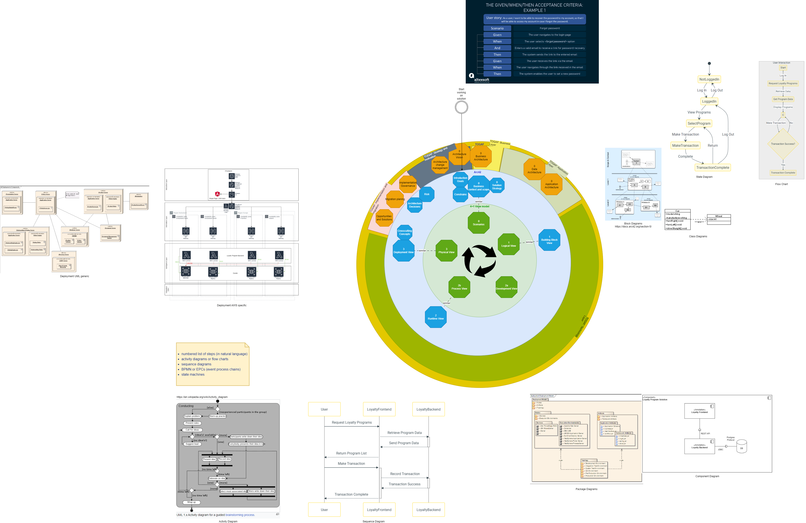

## Intro

For the work on solutions solution architects do use diagrams.

But which diagrams and in which order?

## Source models, views models, frameworks

- There is a [4+1 view model](https://en.wikipedia.org/wiki/4%2B1_architectural_view_model) which is a template for documenting software architectures.

- There is a [arc42](https://docs.arc42.org/home/) which is a template for documenting solutions and lists what to document. arc42 focuses on documenting the key aspects of software systems in a way that's accessible to stakeholders.

- There is a [TOGAF ADM](https://www.visual-paradigm.com/guide/togaf/togaf-adm-tutorial/) which gives you a cyclic lifecycle for enterprise architecture.

The [4+1 view model](https://en.wikipedia.org/wiki/4%2B1_architectural_view_model) and [arc42](https://docs.arc42.org/home/) are more focused on software architecture description and documentation.

While the TOGAF ADM is a comprehensive framework for enterprise architecture development and management.

Still they do handle architecture views in a similar order.

## Diagram

This diagram is trying to capture similarities in which

- [4+1 view model](https://en.wikipedia.org/wiki/4%2B1_architectural_view_model)
- [arc42 documenting template](https://docs.arc42.org/home/) 
- [TOGAF ADM](https://www.visual-paradigm.com/guide/togaf/togaf-adm-tutorial/)

are creating different views of solution architecture.

And also the **types of diagrams**, which one would typically use for the documentation.

## Links

- https://en.wikipedia.org/wiki/4%2B1_architectural_view_model
- https://docs.arc42.org/home/
- https://de.wikipedia.org/wiki/TOGAF
- https://www.visual-paradigm.com/guide/togaf/togaf-adm-tutorial/

