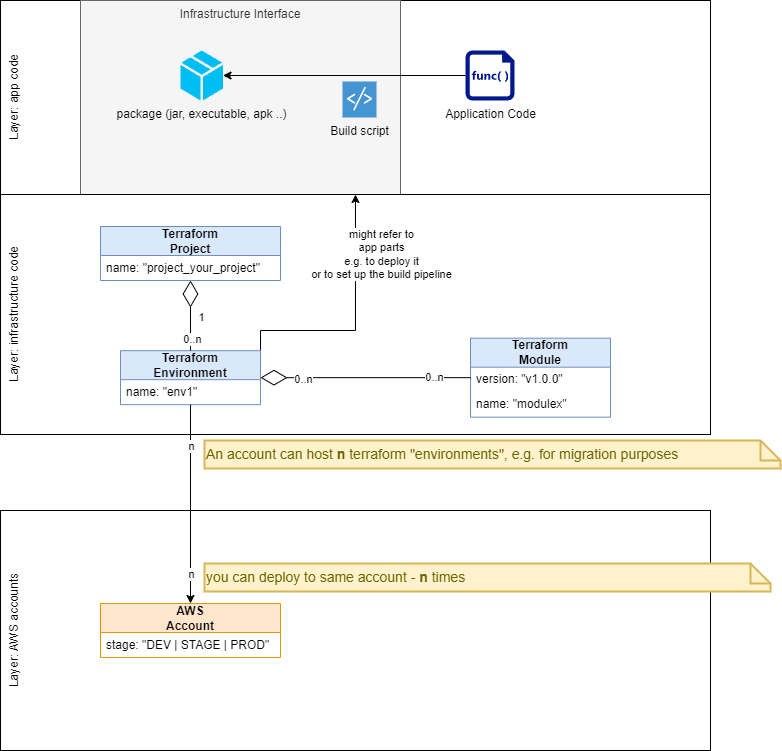

## Intro

Structuring the **software project**.

**Requirements:**

- you must extract your terraform code, to implement "separation of concerns", avoid redundancy
- you must version modules, to allow separate testing of new module-versions and then upgrade
- you must use "terraform-environments", to be able to implement new and untested infrastructure, with new module-versions. So taht you can test it before promoting it

The application part of the project

- might provide scripts to build the app, which will be used by infrastructure
- might provide packages (via a repository, which would enforce versioning etc.)

on GitHub there is a draft of such a project
https://github.com/alfrepo/terraform-skeleton

## Links

