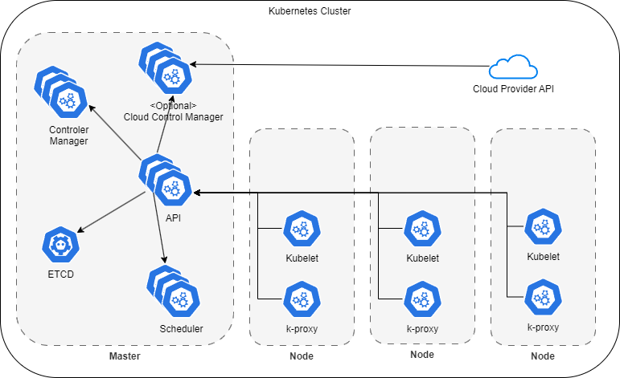

## Intro

Kubernetes architecture notes.

https://medium.com/techbeatly/kubernetes-architecture-deep-dive-520218da0a26

### Master components

#### controller manager

In Kubernetes, controllers are **control loops that watch the state of your cluster**, then make or request changes where needed. Each controller tries to move the current cluster state closer to the desired state.

Examples of controllers

 - Replication Manager (a controller for ReplicationController resources)
 - ReplicaSet, DaemonSet, and Job controllers
 - Deployment controller
 - StatefulSet controller
 - Node controller
 - Service controller
 - Endpoints controller
 - Namespace controller
 - PersistentVolume controller

Details: https://kubernetes.io/docs/concepts/architecture/cloud-controller/

#### OPTIONAL cloud controller manager

Each cloud-controller-manager implements multiple controllers.

    The Cloud Controller Manager (CCM) in Kubernetes is a component responsible for interfacing with the underlying cloud provider's API to manage resources such as load balancers, storage volumes, and networking components. 
    
    It abstracts and translates Kubernetes' resource abstractions into the specific APIs of the cloud provider, enabling seamless integration between Kubernetes clusters and the cloud infrastructure they run on. 
    
    This separation allows Kubernetes to focus on container orchestration while delegating cloud-specific operations to the CCM.

    So AWS can attach AWS-EBS to a K8s cluster via a cloud controller manager.

https://medium.com/@m.json/the-kubernetes-cloud-controller-manager-d440af0d2be5

#### api-server

The API server is a component of the Kubernetes control plane that exposes the Kubernetes API.

#### etcd

Consistent and highly-available key value store used as Kubernetes' backing store for all cluster data.

#### scheduler

The scheduler is a control plane process that assigns pods to nodes. 

Finds nodes for new pods.

scheduling decisions factors:

 - Pod requests for hardware/software resources? Is the node reporting a memory or a disk pressure condition?
 - Does the node have a **label that matches the node selector** in the pod specification?
 - If the p**od requests to be bound to a specific host port**, is that port already **taken** on this node or not?
 - Does the **pod tolerate the taints of the node**?

### Worker components

#### k8s-Service-Proxy (kube-proxy)

It enables "k8s-services", by spanning a virtual network.

It runs **on each worker** and ensures that 

  - one **pod** can talk to another pod, 
  - one **node** can talk to another node, 
  - one **container** can talk to another container, and so on. 

It is responsible for

 - **watching the API Server** 
   - for changes on services and pods definitions to 
   - maintain the entire network configuration up to date. - 

#### Kubelet

Kubelet is an agent that runs on each node in the cluster and is the component responsible for everything running on a worker node.

The main functions of kubelet service are:

 - Register the node it’s running on by **creating a node resource in the API server**.
 - Continuously monitor the API server for Pods that have been scheduled to the node.
 - Start the pod’s containers by using the configured **container runtime**
 - Continuously monitors running containers and reports their status, events, and resource consumption to the API server.
 - enforce lifecycle of container
   - Runs the container **liveness probes** 
   - **restart containers** when the probes fail, 
   - terminate containers when their **Pod is deleted from the API server** and 
   - notifies the server that the **pod has terminated**.

## Links

