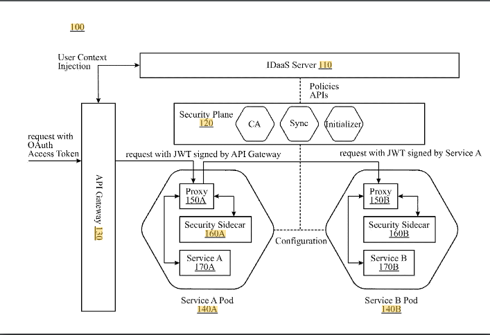

## Intro

How to structure authorization systems of distributed systems

## Structure

| Abbr. |	Term |	Description |
| --- |	--- |	--- |
| PEP |		Policy Enforcement Point |		Point which intercepts user's access request to a resource, makes a decision request to the PDP to obtain the access decision    (i.e. access to the resource is approved or rejected), and acts on the received decision |	
| PDP |		Policy Decision Point |		Point which evaluates access requests against authorization policies before issuing access decisions |	
| PAP |	Policy Administration Point	 |	Point which manages access authorization policies |	
| PIP |		Policy Information Point |		The system entity that acts as a source of attribute values (i.e. a resource, subject, environment) |	
| PRP |		Policy Retrieval Point |		Point where the XACML access authorization policies are stored, typically a database or the filesystem. |	

One doesnt have to use XACML Markup Language, 
but structuring the authorization like PEP, PDP, PAP is extremely useful.

#### In a service-mesh

In a service mesh one can take this approach

## Links

  - XACML https://en.wikipedia.org/wiki/XACML
  - Microservice architecture for identity and access management - for service mesh https://patents.google.com/patent/US20190273746A1/en

