## Intro

How to provision AWS accounts via Organizations.

## First via the Console, to understand the pieces

### 1. Login as Root User to "Management account > Organizations"

 - In management Account
 - As ``Root User`` 
 - login to organizations <https://us-east-1.console.aws.amazon.com/organizations/>
 - create an Account e.g. `` Sandbox`` 

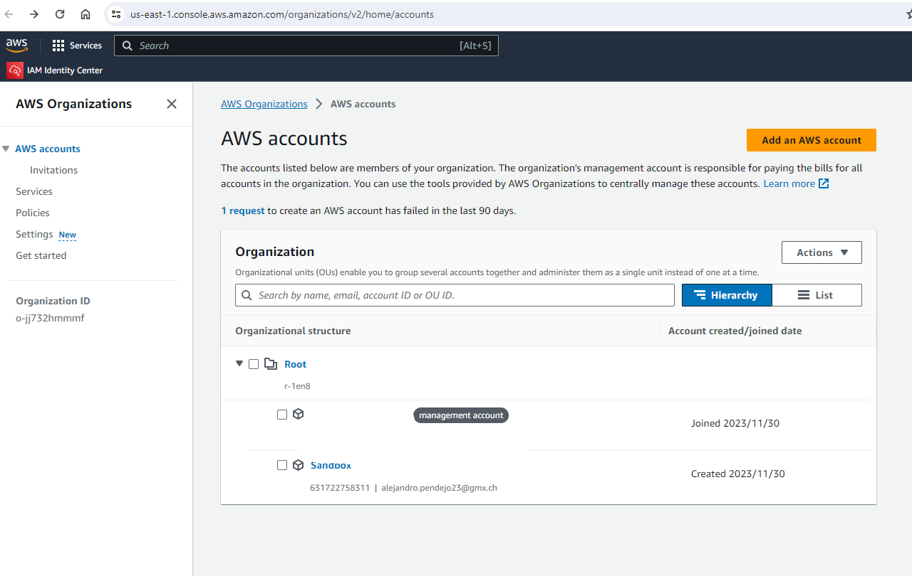

And now.

Here is the gap, how to access teh provisioned account?

### 2. Enable Secrive Control Policies - SCP

- In management Account
- As ``Root User`` 
- Go to SCP <https://us-east-1.console.aws.amazon.com/organizations/v2/home/policies/service-control-policy?region=us-east-1>
- enable SCP 

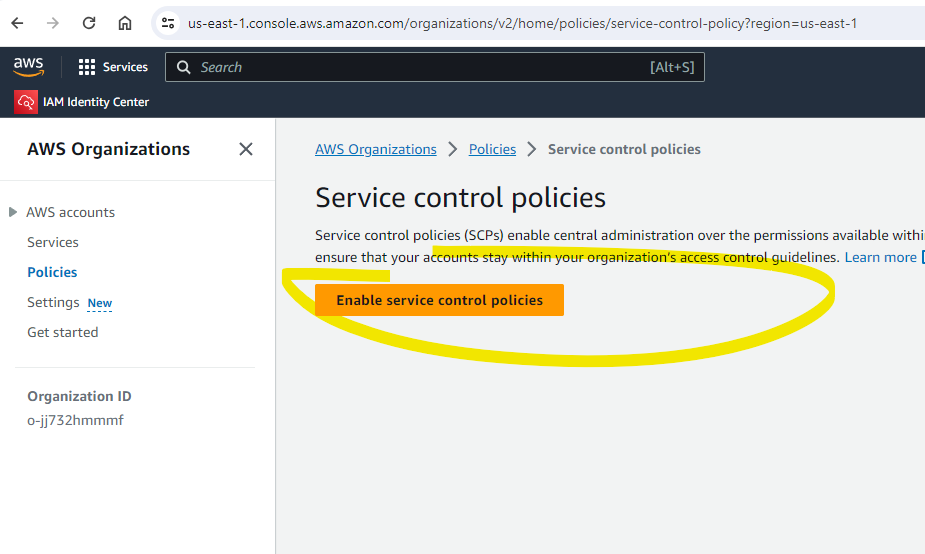

### 3. Create a permission set, group, user

- In "IAM Identity Center" <https://eu-west-1.console.aws.amazon.com/singlesignon/home?region=eu-west-1>
- create permission set. I am reusing the "Predefined permission set" ''AdministratorAccess''

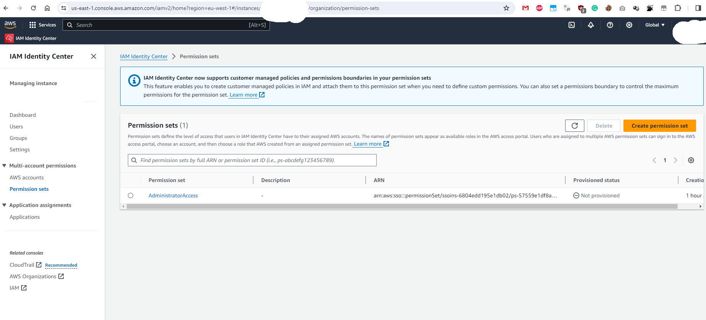

- create user, group <https://eu-west-1.console.aws.amazon.com/singlesignon/home?region=eu-west-1>

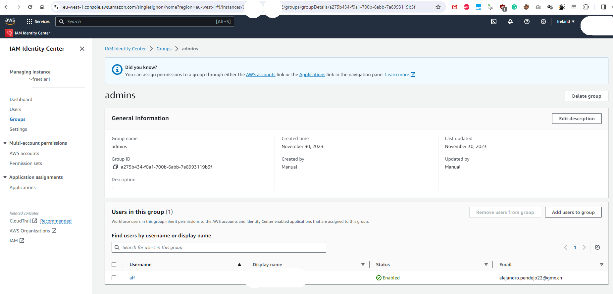

### 4. Assign users and groups to organization accounts

- In "IAM Identity Center > AWS accounts" <https://eu-west-1.console.aws.amazon.com/singlesignon/home?region=eu-west-1>
- Assign users and groups to organization accounts

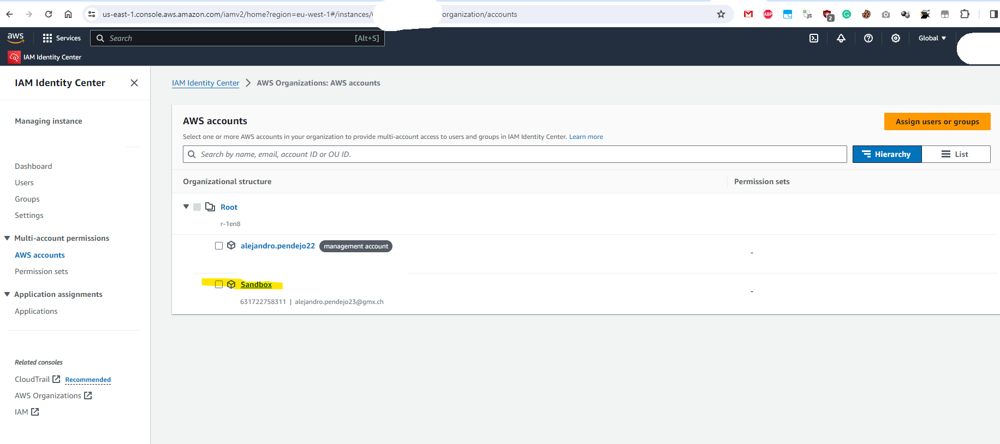

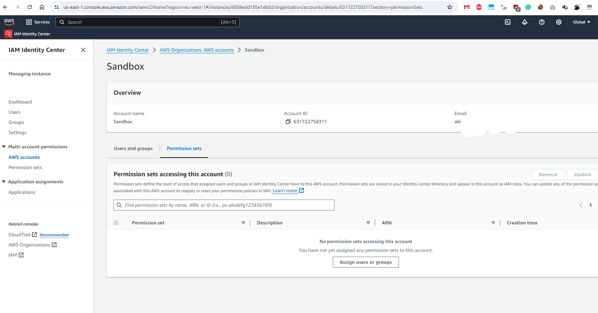

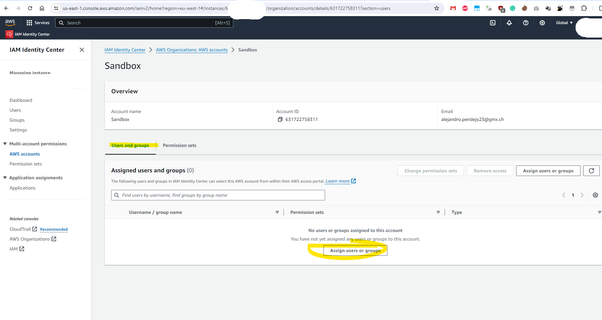

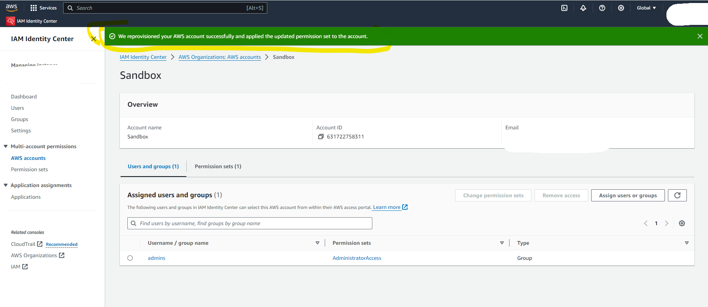

Then the user/role/its permission sets associated are propagated into the associated accounts and you can login.

### 5. SSO into the provisioned account

- Via "AWS access portal URL" link in "IAM Identity Center" <https://eu-west-1.console.aws.amazon.com/singlesignon/home?region=eu-west-1>
- in my case "https://**********1.awsapps.com/start"
- you can open the "AWS access portal URL" from where you can SSO into your accounts, to which you enrolled the user. (dont forget to activate MFA for the user)

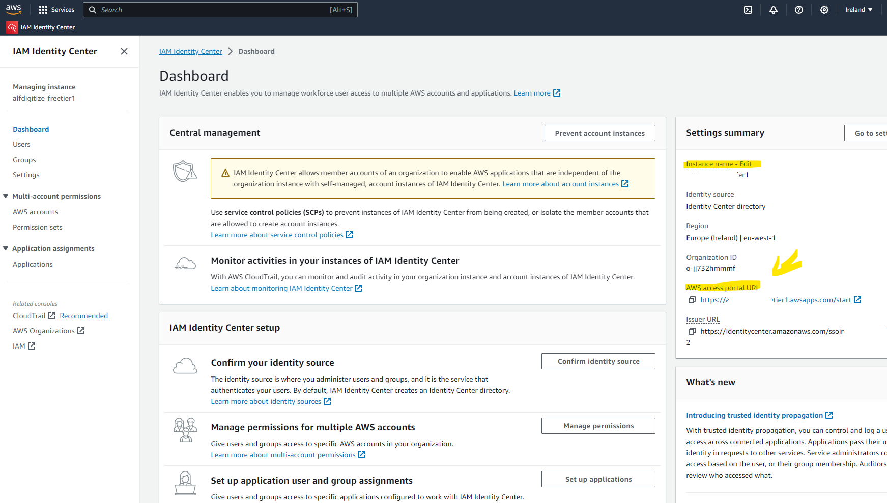

And this is how the SSO portal looks like, allowing you to choose among accounts and roles, which you provisioned earlier into the accounts.

On my picture there is only one master account, but there would be all accounts in your organization.

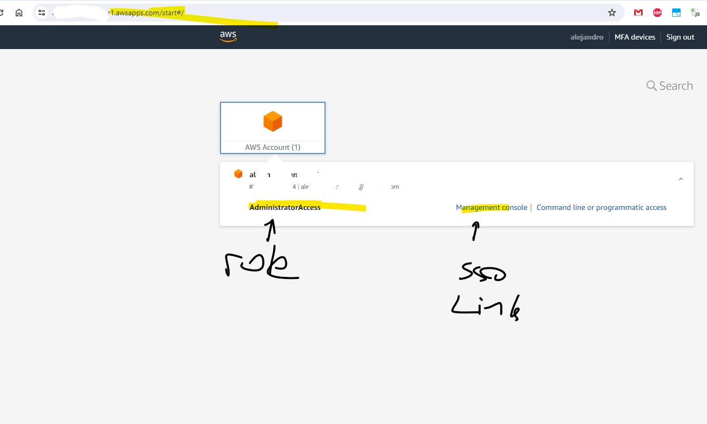

## Programmatically provision accounts

One can use the Terraform module [AWS Control Tower Account Factory for Terraform (AFT)](https://docs.aws.amazon.com/controltower/latest/userguide/taf-account-provisioning.html)

- Read about AFT in this article: <https://aws.amazon.com/de/blogs/aws/new-aws-control-tower-account-factory-for-terraform/>
- Here is a tutorial about AFT usage <https://developer.hashicorp.com/terraform/tutorials/aws/aws-control-tower-aft>

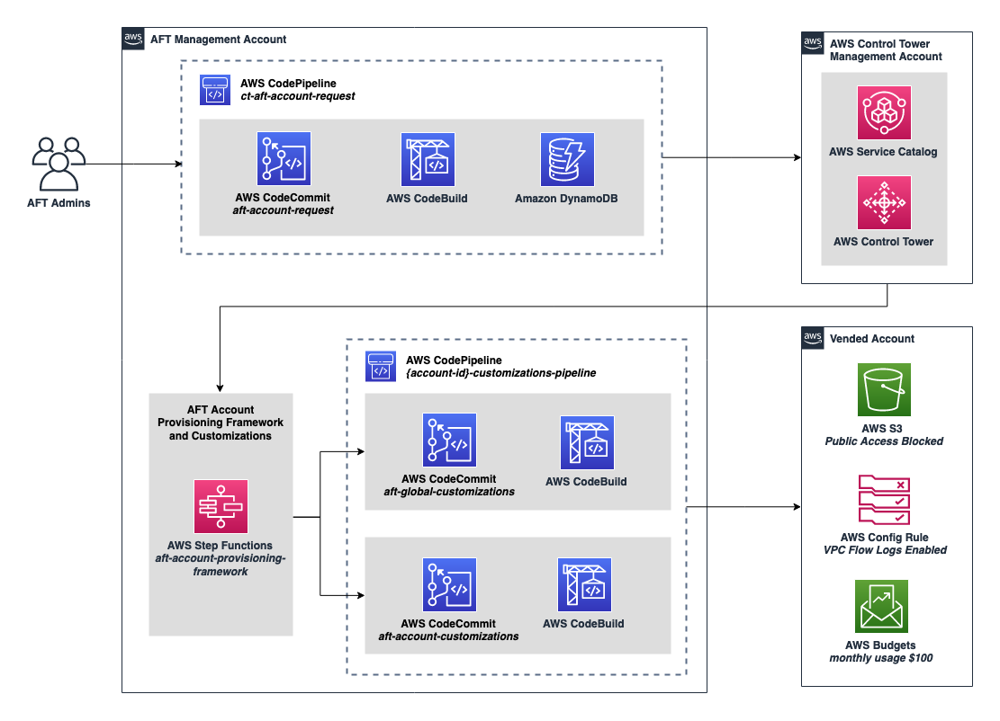

## Links

- 
- <https://aws.amazon.com/de/blogs/mt/deploy-and-customize-aws-accounts-using-account-factory-for-terraform-in-aws-control-tower/>
