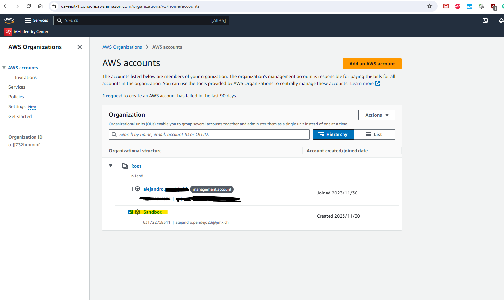
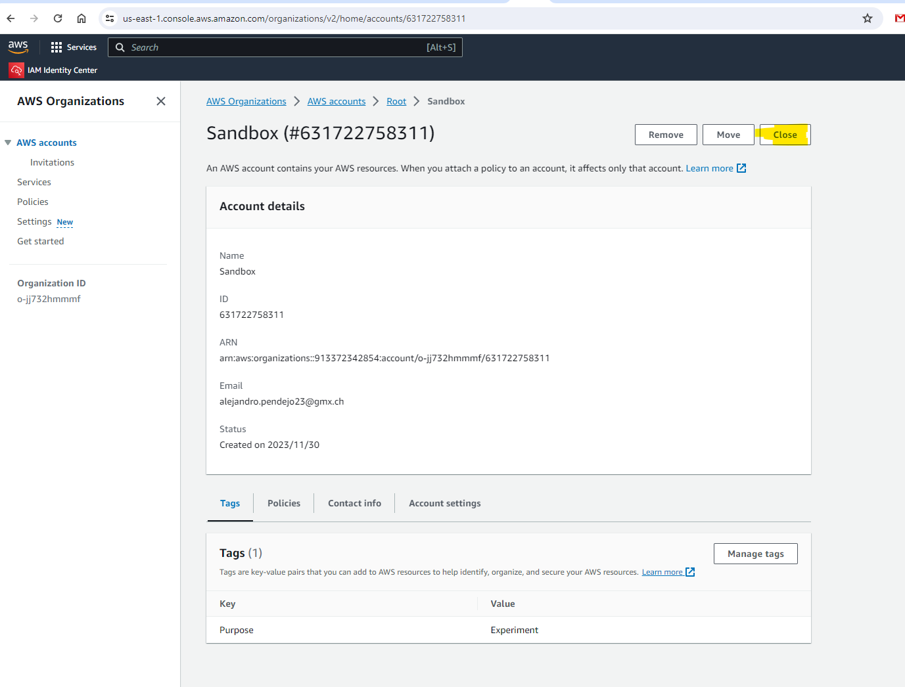

## Intro

How to close AWS account, which is provisioned from organization.

When an account is provisioned from an organization, then the email of the root-user is not even validated.

I once entered test@test.com and couldnt delete the account again.

## How to close the account

So lets ``close`` the account "Sandbox".

The right word is "close", not remove, not delete.

### 1. Login as Root User to "Management account > Organizations"

 - In management Account
 - As ``Root User`` 
 - login to organizations <https://us-east-1.console.aws.amazon.com/organizations/>
 

 - click the account
 - select "close"

 

It will remain "suspended" for 90 days and then will be closed.

## Links
