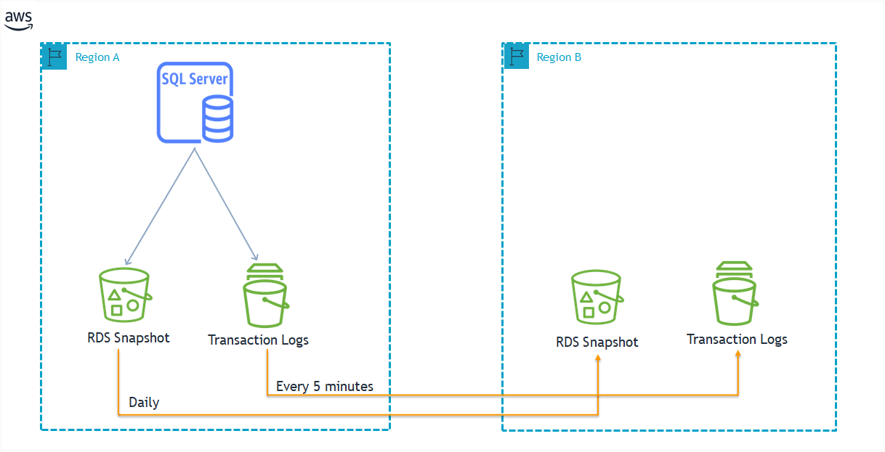

## Intro

List of AWS services, which are helpful for backup and disaster recovery.

## Description

Here is a comparison of four AWS services that are used for disaster recovery and data protection:

| Service | Description | RPO (Recovery Point Objective) | RTO (Recovery Time Objective) | Ideal Use Cases |
|---|---|---|---|---|
| AWS DRS (Disaster Recovery Service) | **Continuous block-level replication**. (**Replicates to EBS**). For Low RPO requirements. A fully managed disaster recovery service that replicates your on-premises workloads to AWS.    This approach ensures an exact replica of the source server's storage, including the **operating system**, system state **configuration**, **databases**, **applications**, and **files**.      **Agent-Based** Replication:  A lightweight agent called the **AWS Replication Agent** is installed on the source server, which is typically the server that hosts the applications and databases to be protected. This agent acts as a bridge between the source server and the DRS replication servers in AWS.  The agent intercepts and captures all block-level changes to the source server's storage. These changes are then efficiently compressed and encrypted before being sent to the replication servers in AWS. This agent-based approach ensures that data is **replicated in real-time, enabling near-zero RPO.**  | Minutes | Minutes | Protects against unplanned outages, reduces RTO, meets compliance requirements.|
| AWS CloudEndure Disaster Recovery | A fully managed disaster recovery service that replicates your on-premises and cloud workloads to AWS. | Minutes | Minutes | Protects against unplanned outages, reduces RTO, simplifies DR planning.  |
| AWS Transfer family | A family of services that allows you to transfer data between on-premises and AWS. | Varies | Varies | Seamless data transfer between on-premises and AWS. |
| AWS Backup | A fully managed backup service that replicates your data to AWS S3. | Days or weeks | Days or weeks | Protects against accidental deletions, ransomware, and other data loss events. |
| RDS - cross-Region automated backups - Disaster Recovery DR | A fully managed backup service that replicates your DB snapshots, transaction logs cross region.  | 0 | Minutes | Protects against RDS database from data loss  |

## Links

- Disaster recovery strategies on AWS <https://cloudian.com/guides/disaster-recovery/disaster-recovery-on-aws-4-strategies-and-how-to-deploy-them/>
- DRS options https://docs.aws.amazon.com/whitepapers/latest/disaster-recovery-workloads-on-aws/disaster-recovery-options-in-the-cloud.html
- <https://aws.amazon.com/de/blogs/database/managed-disaster-recovery-with-amazon-rds-for-sql-server-using-cross-region-automated-backups/>