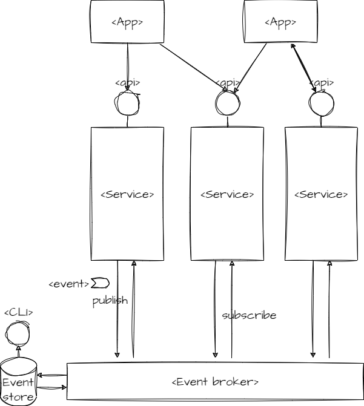

## Intro

If one would accept TOGAF's definition of an "enterprise":

 > any **collection of organizations** that has a **common set of goals** and/or a single bottom line. In that sense, an enterprise can be a government agency, a whole corporation, a division of a corporation, a single department, or a chain of geographically distant organizations linked together by common ownership.`

then, **crowd management** must be a key concern in an evolving enterprise architecture. I will try to explain why below:

## Strategical goals

This statement is indirectly confirmed by [Accelerate - The Science of Lean Software and Devops, by Nicole Forsgren, Jez Humble, Gene Kim 2018, Chapter 5 Architecture](https://kevinvecmanis.io/books/management/2020/11/20/Accelerate-Book-Review.html#architecture) where it is stated,
that the following **statements corelate with top-performing developer-teams**:

 > 1. We can do most of our **testing without requiring an integrated environment**.
 > 1. We can and do **deploy or release our application independently of other applications/services it depends on**.

Hence achieving above statements for dev-teams must be handled as on of **"strategical goals"** for an enterprise-architecture, to achieve top performing dev-teams.

## Tactical goals

1. **modularization**
      - with a **team-distribution-key**, to assign module-responsibility to a single teams.
      - To ensure, that each team is enabled to develop independently from anothers.
      - To ensure clearly defined interfaces between modules and teams.

2. **continuous deployment** of each module separately
      - To enable the team, to deploy its module independently

3. **service virtualization**
      - To be able to test in isolation on module-level.

## Draft the Solution - very high level

- modules for independent development, testing and deployment
      - Use **services**, as **modules for backend**.
      - Use **apps**, as **modules for frontend**.
- Use the `Event sourcing` pattern, to introduce **loosely coupled** interfaces between services. To make sure the `*ilities` can be realised easier.
- Use apis, to introduce `synchronous interfaces` between apps and services.

How exactly to set-up the communication between modules
e.g. to keep the horizontal scaling and consistancy - will be the topic of further articles.

## Links

- On `Event sourcing` pattern [by Azure](https://learn.microsoft.com/en-us/azure/architecture/patterns/event-sourcing)
- On `ilities` [by Wikipedia](https://en.wikipedia.org/wiki/List_of_system_quality_attributes#:~:text=Within%20systems%20engineering%2C%20quality%20attributes,many%20of%20the%20words%20share.)

## Next

Next we should expand different facettes of the draft and processes around it.