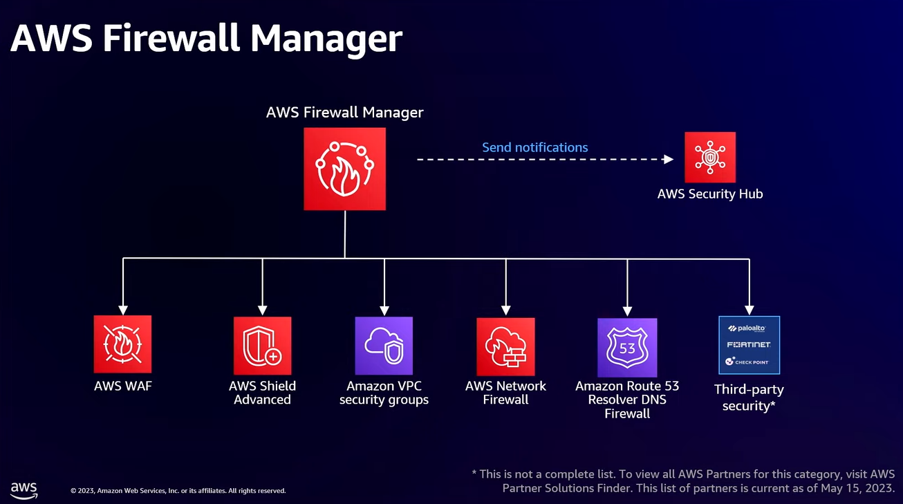

## Intro

AWS Firewalls - overview

## Description

Here’s the list of AWS Firewall Services with the OSI Layer, Rules and Additional Rules Factors, and Types of Attacks Protected Against:

Here is a comparison of AWS firewall services:

| Firewall service | Best use cases |
|---|---|
| WAF | Protecting **web applications** from **common web attacks** |
| Shield Advanced | Protecting against **DDoS attacks**, intrusion detection and prevention, and malware scanning |
| Security Groups | Controlling **traffic to and from your EC2** instances and network interfaces |
| Network Firewall | Filtering traffic at the **perimeter of your VPC** |
| Route 53 Resolver Firewall | Filtering traffic **to and from Amazon Route 53** |

and in details

| Feature | Type of firewall | Purpose | Scope of protection | Managed vs. self-managed | Ease of use | Scalability | Cost | Best use cases |
|---|---|---|---|---|---|---|---|---|
| Web Application Firewall (WAF) | Layer 7 | Protect web applications | All web traffic | Managed | Easy | Large traffic | Rules | Web application security |
| Shield Advanced | Layer 3, Layer 4 | Protect against DDoS, IDS/IPS, malware | All traffic | Managed | Easy | Large traffic | Resources | DDoS protection, IDS/IPS, malware scanning |
| Security Groups | Layer 3 | Control traffic | EC2 instances, network interfaces | Self-managed | Moderate | Large traffic | EC2 instances, network interfaces | EC2/network interface control |
| Network Firewall | Layer 3 | Filter traffic at VPC perimeter | Traffic to/from VPC | Managed | Moderate | Large traffic | VPCs | VPC traffic filtering |
| Route 53 Resolver Firewall | Layer 3 | Filter traffic to/from Route 53 | Traffic to/from Route 53 | Managed | Moderate | Large traffic | Route 53 resolver endpoints | Route 53 traffic filtering |

* **AWS Firewall Manager**

   *  Firewall Manager uses AWS Config in the background.

   * AWS Firewall Manager is a security management service that helps across multiple accounts

* **AWS Network Firewall**
   * OSI Layer: Layer 3 and 4
   * Rules and Additional Rules Factors: Stateful, port-based, source-destination IP address rules, source IP address, destination IP address, protocol, port number, application protocol
   * Types of Attacks Protected Against: Network-level attacks, Layer 7 attacks

* **AWS WAF (Web Application Firewall)**
   * OSI Layer: Layer 7
   * Rules and Additional Rules Factors: Static, rate-based, byte match rules, source IP address, destination IP address, URL path, HTTP header, HTTP body
   * Types of Attacks Protected Against: Common web application attacks, zero-day attacks

## Links
