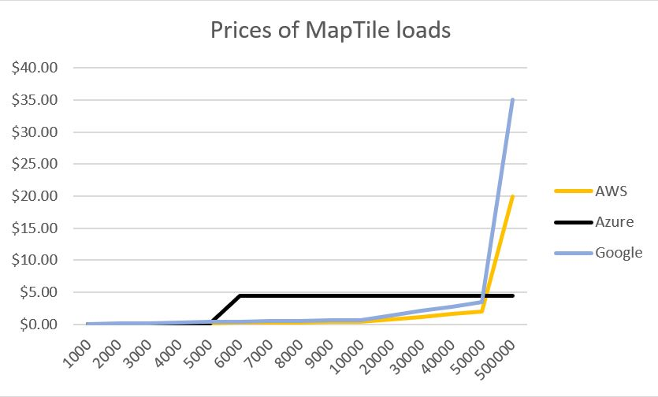

## Intro

Lets compare the prices for the major Map-SDK providers

- AWS Locations
- Azure Maps
- Google Maps

### Use Case

``` shell
As the site-user,
I enter the site
AND WHEN my GPS coodinates G is retrieved succesfully,
OR when I navigate to a GPS coodinates G on the dynamic map
THEN I retrieve allPOIs around G with radius R
```

### Prices

Looks like the simplest dynamic of tiles is enough for this use-case.

Lets look at the prices:

| Map tiles retrieved | AWS    |  Azure |  Google |
| ------------------- | ------ |  ----- |  ------ |
| 1000                | $0.04  |  $0.00 |  $0.07  |
| 2000                | $0.08  |  $0.00 |  $0.14  |
| 3000                | $0.12  |  $0.00 |  $0.21  |
| 4000                | $0.16  |  $0.00 |  $0.28  |
| 5000                | $0.20  |  $0.00 |  $0.35  |
| 6000                | $0.24  |  $4.50 |  $0.42  |
| 7000                | $0.28  |  $4.50 |  $0.49  |
| 8000                | $0.32  |  $4.50 |  $0.56  |
| 9000                | $0.36  |  $4.50 |  $0.63  |
| 10000               | $0.40  |  $4.50 |  $0.70  |
| 20000               | $0.80  |  $4.50 |  $1.40  |
| 30000               | $1.20  |  $4.50 |  $2.10  |
| 40000               | $1.60  |  $4.50 |  $2.80  |
| 50000               | $2.00  |  $4.50 |  $3.50  |
| 500000              | $20.00 |  $4.50 |  $35.00 |



### Conclusion

Looks like the following is the case.

Probably this comparison is indicative also for the other Maps-related services, I have not looked at them in detail.

#### AWS

is good for small amounts of map-loads,
**good for a start up**, to start with a small traffic.

#### Google Maps

is also cheap for small amounts of map-loads.
But a bit more expensive, than AWS for dynamic maps.
Probably it has a **richer API**, when looking in dept.
But for the use-case above - not necessary needed.

#### Azure

Gives you some **stuff for free**.
And then a **stable pricing till a relative high amount** of loads.

## Links

Links to pricing models of SDK providers

- <https://aws.amazon.com/location/pricing/?nc1=h_ls>
- <https://azure.microsoft.com/en-us/pricing/details/azure-maps/>
- <https://developers.google.com/maps/billing-and-pricing/pricing?hl=de>
