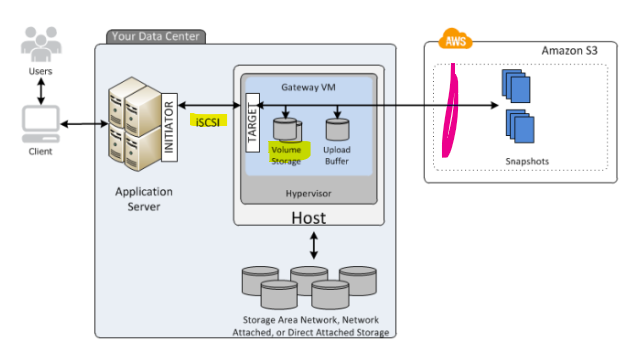
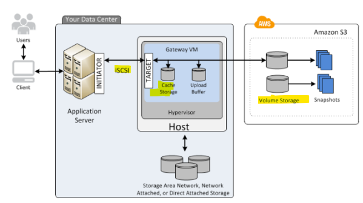
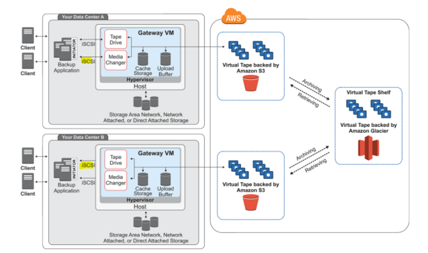

## Intro

AWS Storage Gateway 

AWS transfer Family

## Description

### AWS Storage Gateway 

Types:

- File Gateway
- Volume Based Gateway
  - using Gateway **STORED** Volumes
  - using Gateway **CACHED** Volumes
- Tape Based Gateway

#### File Gateway

  - Purpose:
     - provides access to objects in S3 as files or file share mount points. It can be considered as a file system mount on S3
    
  - UseCase:
     - cost-effective alternative to on-premises storage.

  - How:
    - Software appliance, or gateway, is deployed into the on-premises environment.
    - Allow access via: **NFS, SMB**
    - Like a "share folder" that sits in AWS S3

  - When to use:
     - when **some network delay** accessing files is OK

Example of File GW usage with Transfer Family.

#### Volume Based Gateway

Types:

- Gateway STORED Volumes
- Gateway CACHED Volumes

Summary:

  - Purpose:
     - provides access to objects in S3 as files or file share mount points. It can be considered as a file system mount on S3
    
  - How:
    - Allow access via: **ISCSI**
    - iSCSI protocol **works at the block level**, it can generally **provide higher performance than NFS** by manipulating the remote disk directly

##### Volume Based Gateway Type: Gateway STORED Volumes

  - UseCase: 
      - store up to 1 PB. But only most popular files are available / cached locally in cloud

##### Volume Based Gateway Type: Gateway CACHED Volumes

  - UseCase:
    - on prem - store up to 512 TiB on the Gateway. 
    - and **asynchronously backs up point-in-time snapshots** (in the form of **EBS snapshots**) of the **data to S3** which provides **durable off-site backups**
	

#### Tape Based Gateway

  - Purpose:
    - secure transfer service that helps transfer files into and out of AWS storage services

	- How:
	  - Runs in cloud
    - Offers **Virtual Tape**, **Virtual Tape Library (VTL)** interfaces
		- Stores on **S3 Glacier** 

  - When to use:
     - wanna migrate tape

## Links

- <https://aws.amazon.com/blogs/storage/centralize-data-access-using-aws-transfer-family-and-aws-storage-gateway/>
- <https://jayendrapatil.com/aws-transfer-family/>