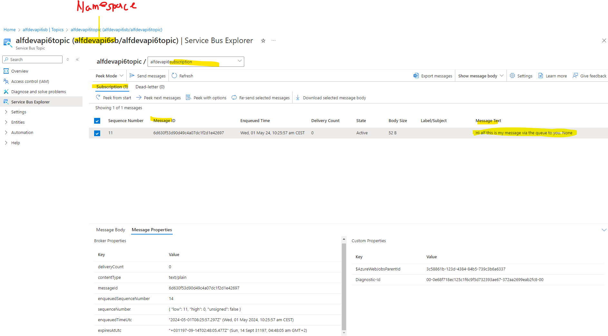

## Intro

How is the 


### Concepts behind Azure Service Bus


The concepts of Azure Service Bus in one picture and their relationships / cardinality.





Some example code in python for the Publishier / Consumer.

Publisher
``` python

@app.route(route="http_trigger_topic", auth_level=func.AuthLevel.ANONYMOUS)
@app.service_bus_topic_output(arg_name="message",
                              connection="ServiceBusConnection",
                              topic_name="T1")
def http_trigger_topic(req: func.HttpRequest, message: func.Out[str]) -> func.HttpResponse:
    logging.info('Python HTTP trigger function processed a request.')

...

```


Consumer
``` python
@app.service_bus_topic_trigger(arg_name="azservicebus", 
                               connection="ServiceBusConnection",
                               topic_name="T1",
                               subscription_name="ServiceC_T1"
                               ) 
def servicebus_trigger(azservicebus: func.ServiceBusMessage):
    logging.warn('Python ServiceBus Queue trigger processed a message: %s',
                azservicebus.get_body().decode('utf-8'))
```


## Links

- https://learn.microsoft.com/en-us/azure/service-bus-messaging/service-bus-queues-topics-subscriptions
- <https://learn.microsoft.com/en-us/azure/service-bus-messaging/message-sessions#session-features>
- <https://learn.microsoft.com/en-us/azure/architecture/patterns/publisher-subscriber>
- <https://learn.microsoft.com/en-us/azure/architecture/patterns/priority-queue>
- <https://learn.microsoft.com/en-us/azure/service-bus-messaging/authenticate-application#resource-scope>
- <https://learn.microsoft.com/en-us/azure/service-bus-messaging/service-bus-messaging-overview#transactions>
- <https://learn.microsoft.com/en-us/azure/service-bus-messaging/message-sessions>

