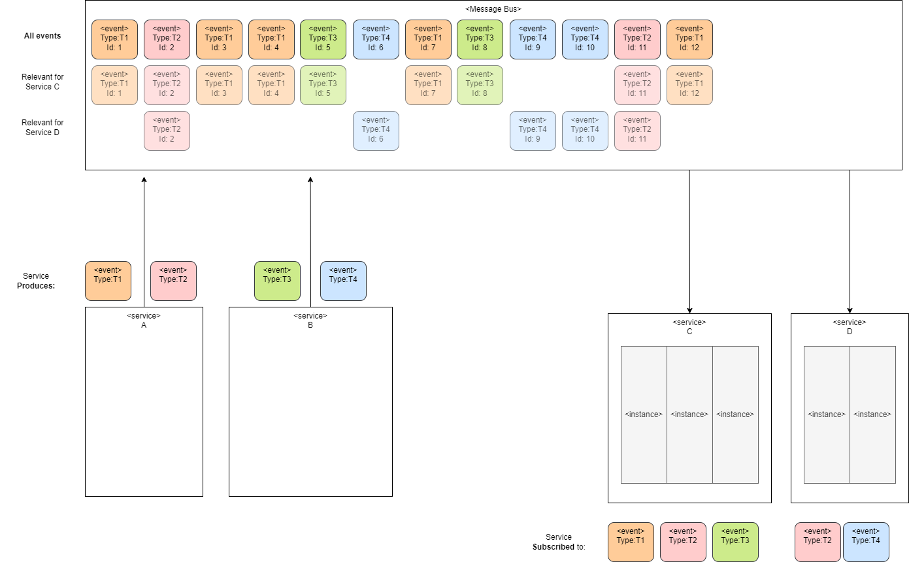
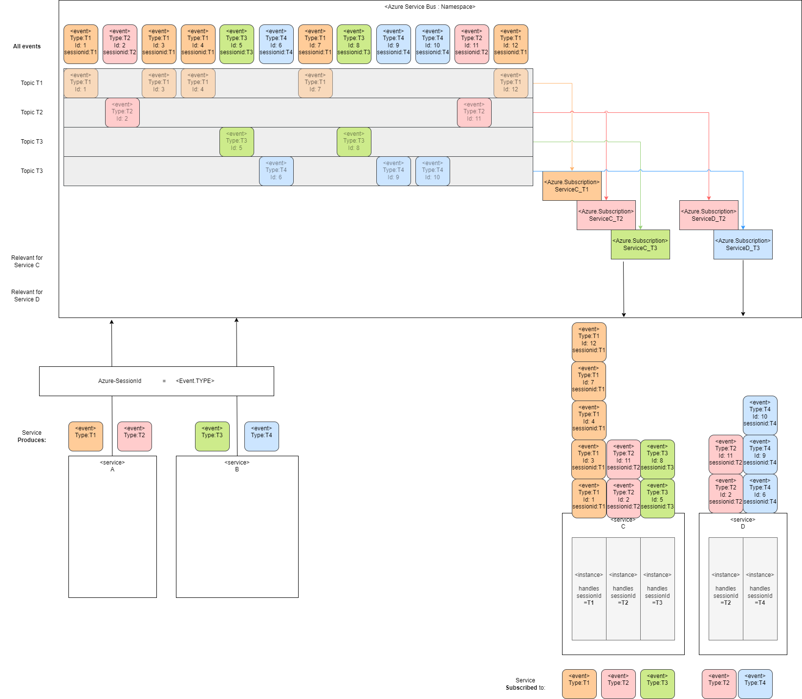
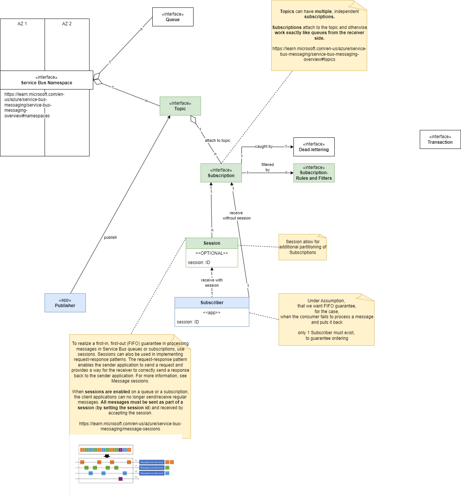

## Intro

How to implement inter-Service communication
making sure, that 
 - **"FIFO" guarantee** with  Azure Service Bus is implemented
 - **"FIFO" guarantee** with the Azure Service Bus is used


Goal:

 - There are 2 Producer Services: A and B
   - **Service A** produces events of type: **T1, T2**
   - **Service B** produces events of type: **T3, T4**

 - There are 2 Consumer Services: C and D
   - Consumer services scale horizontally, so each of them has multiple instances
   - Each instance will consume those types of events from the message bus, in which its interested in
   - Each instance can fail after a while and put back the event, for reprocessing. That must NOT affect the order.




## Constraint 1

Site constraint:

Let the consumer process the events 
- in the FIFO order

  - order is relevant, only within a single message-type


### Description

The approach:

can be solved by using 

- one topic per message-type, to enable services to subscribe for **message-types of interest only** 
- use an own **subscription** per service, to introduce a dedicated **sub-queue** per service. <br /><br /> See "A topic subscription resembles a virtual queue that receives copies of the messages that are sent to the topic." <https://learn.microsoft.com/en-us/azure/service-bus-messaging/service-bus-queues-topics-subscriptions>
- use "**sessions-ids**" to demultiplex messages and map those to instances in each service. <br /><br /> See "Sessions provide concurrent demultiplexing of interleaved message streams while preserving and guaranteeing ordered delivery" https://learn.microsoft.com/en-us/azure/service-bus-messaging/message-sessions#session-features <br /><br /> In the example those are **per message-type**, but they can be per meaningful session-identifier like "orderId"




The concepts of Azure Service Bus in one picture and their relationships / cardinality.




Some example code in python for the Publishier / Consumer.

Publisher
``` python

@app.route(route="http_trigger_topic", auth_level=func.AuthLevel.ANONYMOUS)
@app.service_bus_topic_output(arg_name="message",
                              connection="ServiceBusConnection",
                              topic_name="T1")
def http_trigger_topic(req: func.HttpRequest, message: func.Out[str]) -> func.HttpResponse:
    logging.info('Python HTTP trigger function processed a request.')

...

```


Consumer
``` python
@app.service_bus_topic_trigger(arg_name="azservicebus", 
                               connection="ServiceBusConnection",
                               topic_name="T1",
                               subscription_name="ServiceC_T1"
                               ) 
def servicebus_trigger(azservicebus: func.ServiceBusMessage):
    logging.warn('Python ServiceBus Queue trigger processed a message: %s',
                azservicebus.get_body().decode('utf-8'))
```


## Links

- 
- <https://learn.microsoft.com/en-us/azure/service-bus-messaging/service-bus-messaging-overview#transactions>
- <https://learn.microsoft.com/en-us/azure/service-bus-messaging/message-sessions>

