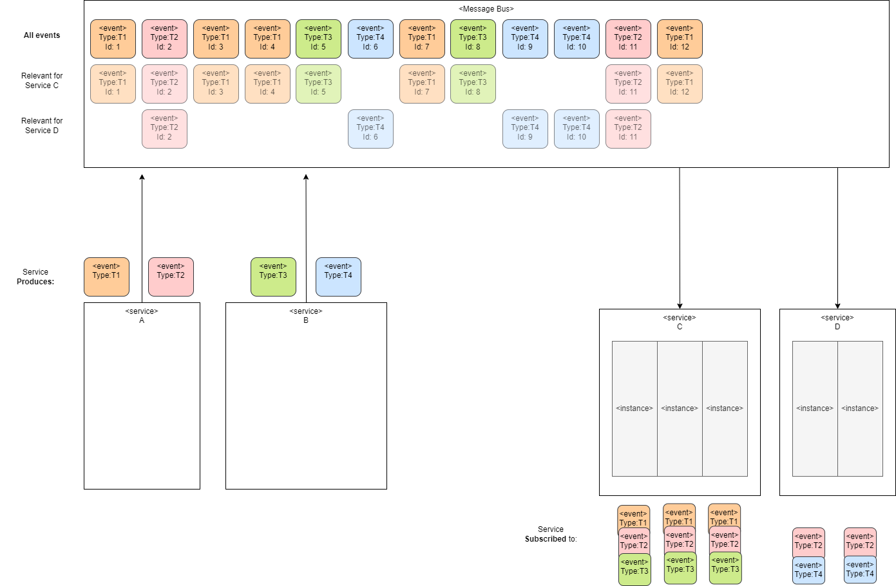
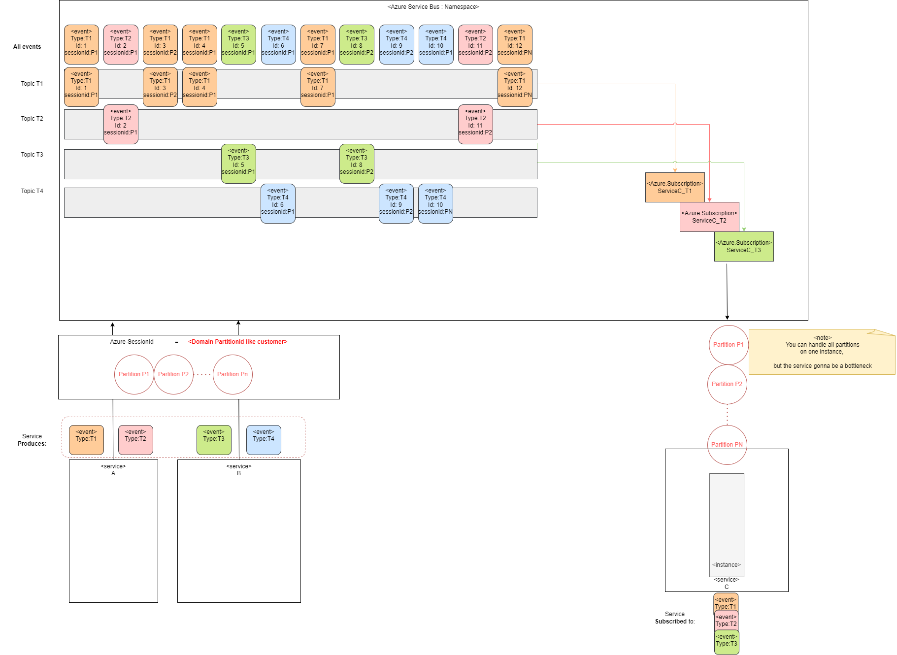
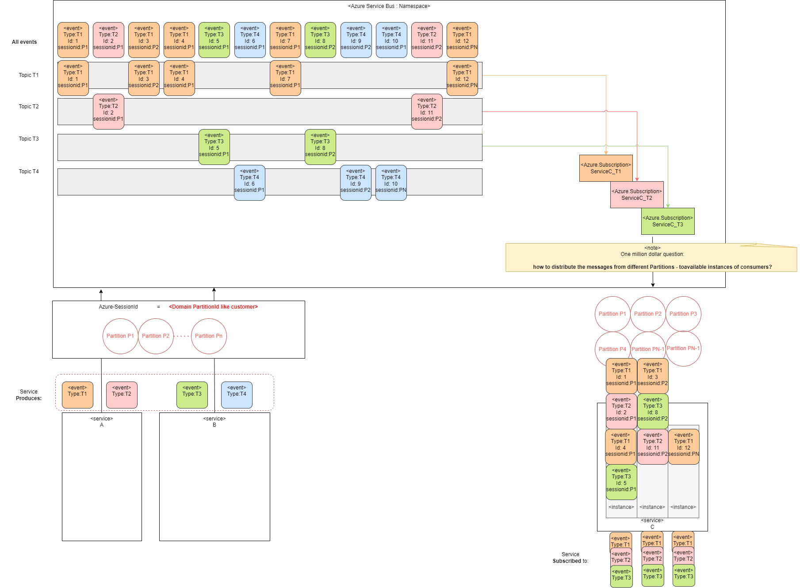
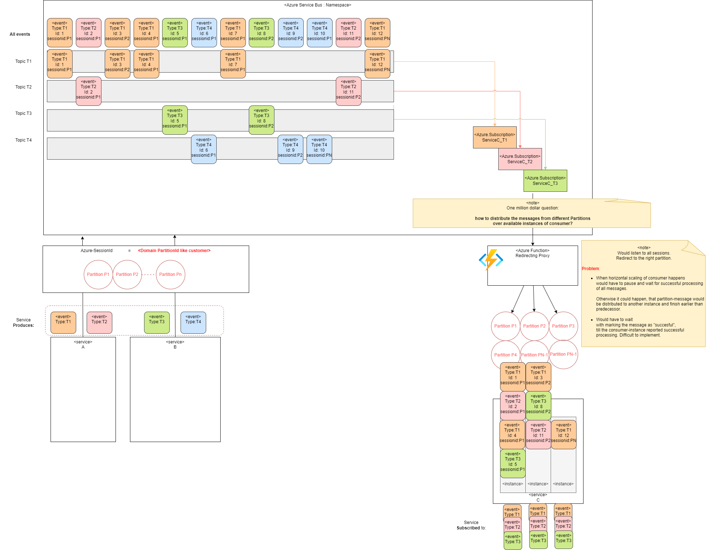
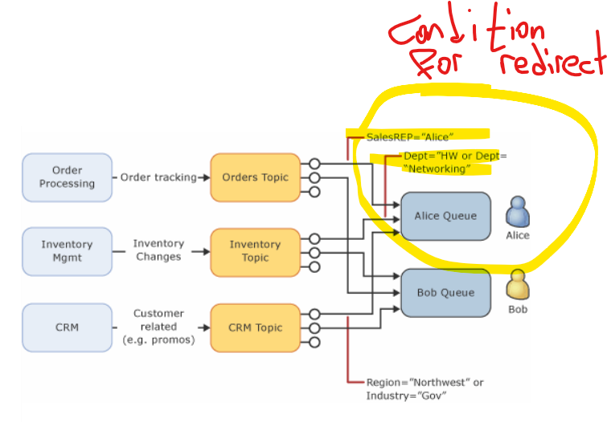
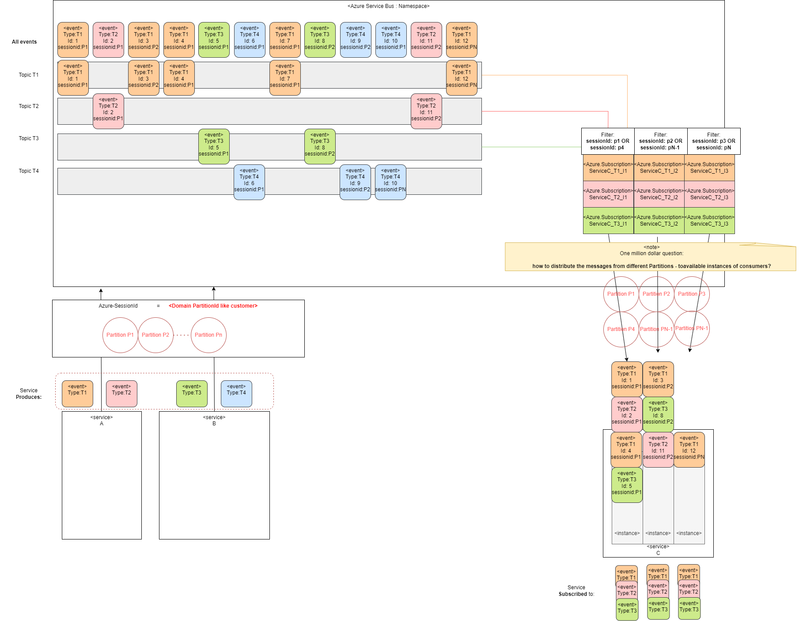
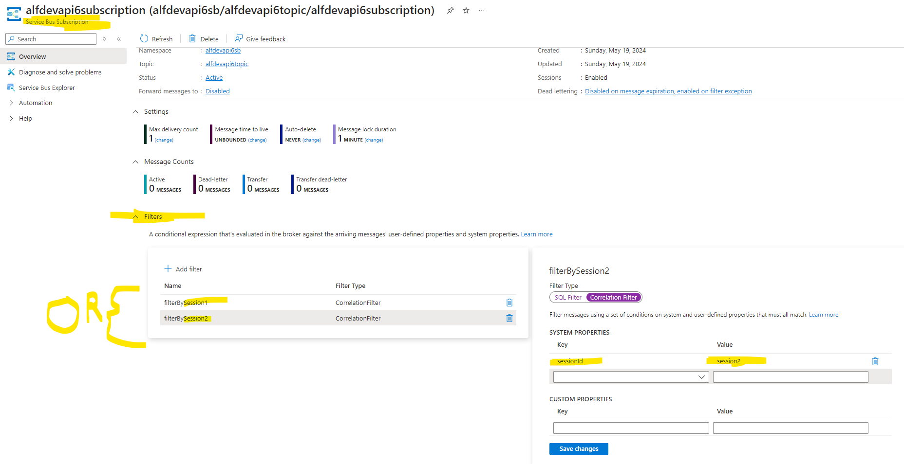

## Intro

How to implement inter-Service communication
making sure, that 
 - **"FIFO" guarantee** with  Azure Service Bus is implemented
 - **"FIFO" guarantee** with the Azure Service Bus is used

### Goal

 - There are **2 Producer** Services **A and B**
   - **Service A** produces events of type: **T1, T2**
   - **Service B** produces events of type: **T3, T4**

 - There are **2 Consumer** Services: **C and D**
   - Consumer services **scale horizontally**, so each of them has **multiple instances**
   - Each instance will consume those types of events from the message bus, in which its interested in
   - Each **instance can fail** after a while and put back the event, for reprocessing. That must NOT affect the event processing order.

### Constraints

 - The  **FIFO ORDER** MUST be enforced within a **single message-type**

        That's to simulate the situation, where each service is sending its own events and is not aware of what others are doing, which is realistic.

- **each service-instance can consume MULTIPLE event-types**.
- **consumers scale horizontally** and at **RUNTIME**. Depending on load.
- **producers** MUST be **decoupled from consumers** 
  - Means producer MUST NOT be involved into **how consumers do scale out**

### Description

The approach:

On the producer service:
- Pick a **partitioning** approach, which makes sence from the **domain-perspective**. (e.g. the customerId)
  - it must be a partition, which can be processed isolated from the others (like messages of one dedicated customer. Or country. )

On the consumer service:
- Distribute partitioned messages on **some consumer instances**
  - **messages from same partition - must be mapped always to same instance**. To avoid the situation, where message from same partition is consumed on 2 instances, finish at different time, break the processing order.
  - there **can** be much more **message-partitions**, than **consumer-instances**. Just find a way to dstribute partitions evenly on consumers.

#### Horizontal scaling consumer

So consumer  would scale horizontally.

- But who would assign partitions to consumer-instances?
- But who would distribute the messages to consumer-instances?

#### Try use a "Redirecting Proxy"

You could try implement a Redirecting Proxy Azure-function.

Which would redirect the messages from the original queues
over all available consumer instances.

But this task has a lot of challenges.

- When **horizontal scaling of consumer happens**
Redirecting Proxy would have to pause and wait for successful processing of all messages.
Otherwise it could happen, that partition-message would be distributed to another instance and finish earlier than predecessor.

- Redirecting Proxy would have to **wait
with marking the message as "succesful"**,
till the consumer-instance reported successful processing. Otherwise the message might be lost, when the consumer-instance fails.

Its difficult to implement.

Also Redirecting Proxy might become a bottleneck.

#### Try use auto-forwarding

The most stable variant is probably to use the "auto-forwarding".

- <https://learn.microsoft.com/en-us/azure/service-bus-messaging/service-bus-auto-forwarding>
- <https://techcommunity.microsoft.com/t5/apps-on-azure-blog/robust-messaging-using-azure-service-bus/ba-p/3275225>
- <https://learn.microsoft.com/en-us/azure/service-bus-messaging/enable-auto-forward>
- <https://learn.microsoft.com/en-us/azure/service-bus-messaging/service-bus-auto-forwarding>

By regrouping the messages 
- by partitions, as expected by consumer-instances

One can **probably** achieve the effect of stable horizontal scaling.

Just express the redirect-condition to be group messages, as expected by consumer instances.

#### Try use subscription-filters

You can just generate dedicated subscriptions,  
which will **filter out** messages  
from **partitions, relevant to a consumer-instance**.

The instances will have to subscribe to different subscriptions then.

This is how to apply the **session-filters**.

<https://learn.microsoft.com/en-us/azure/service-bus-messaging/topic-filters>

#### Try use Azure-service-bus-namespace with partitioning enabled

When a message is enqueued into a partitioned queue or topic, Service Bus checks for the presence of a **partition key**. If it finds one, it **selects the partition based on that key**.

Scenario SessionId based Partitions

    SessionId: If a message has the session ID property set, then Service Bus uses it as the partition key. This way, all messages that belong to the same session are handled by the same message broker. Sessions enable Service Bus to guarantee message ordering as well as the consistency of session states.

Question: how to define a partition key, with **multiple sessionIds** ?

See:
<https://learn.microsoft.com/en-us/azure/service-bus-messaging/service-bus-partitioning#use-of-partition-keys>

To create a namespace with partitioning enabled, set partitions to a number larger than 1 in the namespace properties section. In the example below a partitioned namespace is created with 4 partitions, and 1 messaging unit assigned to each partition. For more information, see Microsoft.ServiceBus namespaces template reference.

<https://learn.microsoft.com/en-us/azure/service-bus-messaging/enable-partitions-premium>

**Why this variant wont work!**

- In Azure Service Bus, it’s **not possible to subscribe to a single partition only**. 
- Hence one instance **will not be able to choose** the partition / sessionIds to consume.

See 
<https://learn.microsoft.com/en-us/azure/service-bus-messaging/service-bus-partitioning>

### Conclusion

TODO

## Links

- https://learn.microsoft.com/en-us/azure/service-bus-messaging/service-bus-queues-topics-subscriptions
- <https://learn.microsoft.com/en-us/azure/service-bus-messaging/message-sessions#session-features>
- <https://learn.microsoft.com/en-us/azure/architecture/patterns/publisher-subscriber>
- <https://learn.microsoft.com/en-us/azure/architecture/patterns/priority-queue>
- <https://learn.microsoft.com/en-us/azure/service-bus-messaging/authenticate-application#resource-scope>
- <https://learn.microsoft.com/en-us/azure/service-bus-messaging/service-bus-messaging-overview#transactions>
- <https://learn.microsoft.com/en-us/azure/service-bus-messaging/message-sessions>

