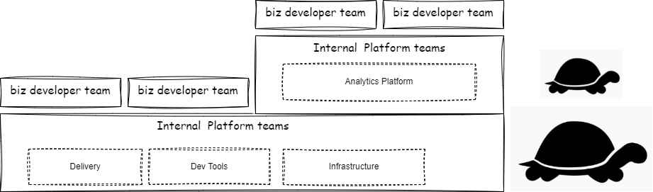
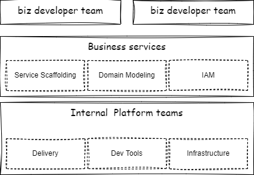

## Intro

What are platform teams

#### Whats a platform?

> A digital platform is a foundation of self-service APIs, tools,
services, knowledge and support which are arranged as a compelling
internal product. Autonomous delivery teams can make use of the
platform to deliver product features at a higher pace, with reduced
coordination

Source Martin Fowler, Evan Bottcher: <https://martinfowler.com/articles/talk-about-platforms.html>

#### Which models have I seen?

##### Only the platform

Source: <https://internalplatforms.com/>

##### Unified business service layery

#### How to measure Platform-as-a-Product?

Bei einem Platform-as-a-Product-Ansatz sollten vier Elemente berücksichtigt werden: 
 - Plattform Value (Strategie), 
 - Plattform Customers, 
 - Plattform/Developer Experience 
 - Adoption Cycle.

#### Try use Azure-service-bus-namespace with partitioning enabled

### Conclusion

TODO

## Links

- <https://internalplatforms.com/resources.html>
- <https://teamtopologies.com/key-concepts>
- What is a 'Platform' anyway? <https://martinfowler.com/articles/talk-about-platforms.html>

