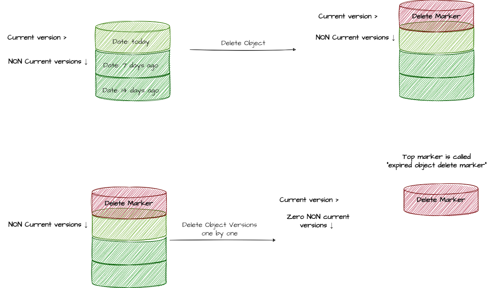
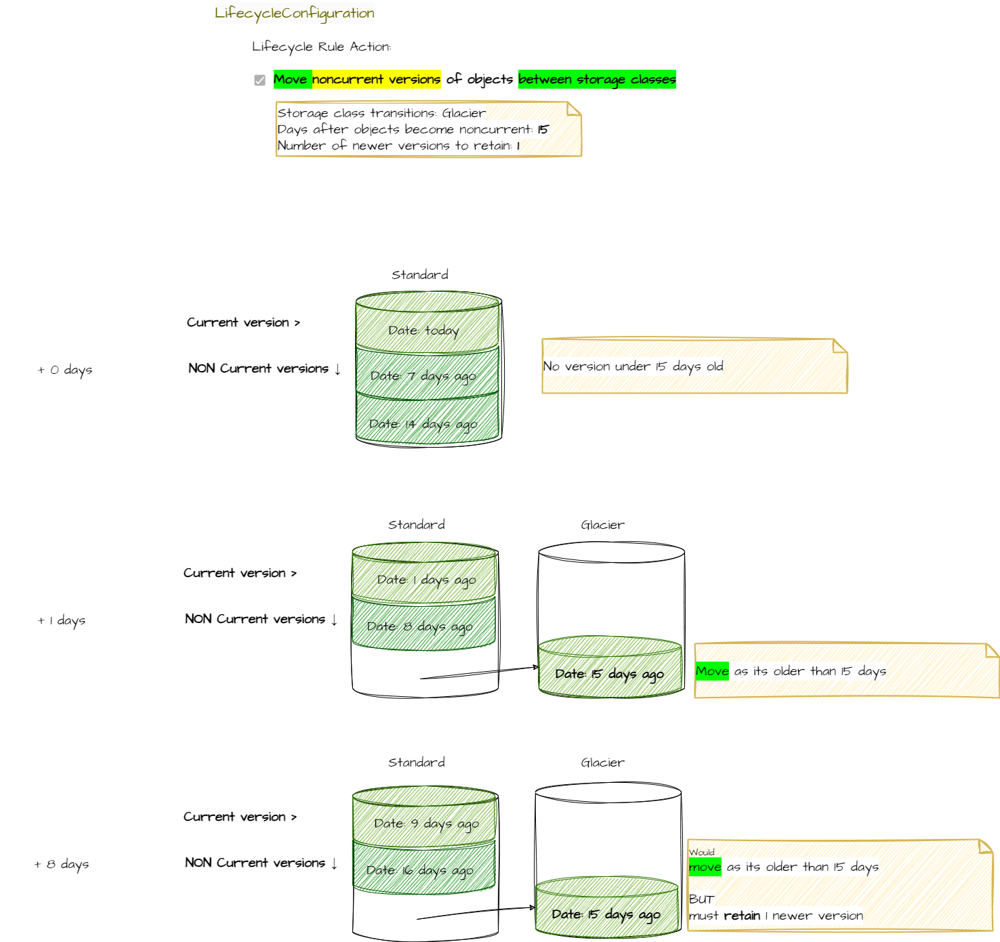

## Intro

How does one configure the lifecycle management of AWS S3 exactly?

I find it confusing, how the rules in "lifecycle management" of S3 are formulated.
There are following oftions, which uncover further configurations:

- Move **current versions** of objects **between storage classes**
- Move **noncurrent versions** of objects **between storage classes**
- **Expire** the **current versions of objects** (what does expire even mean here?)
- **Permanently delete** the **noncurrent versions** of objects
- **Delete** the **expired object** delete **markers** or **incomplete multipart uploads**

They seem intuitive, but in detail its less clear:

- how "delete markers" interfer with "versions"
- what does "expire" mean for current 

### The model behind S3 versioning

Lets understand the model behind the behind S3 versioning.



### Noncurrent versions of objects - move between storage classes

| Subject  | Action |
|---|---|
| noncurrent versions of objects |  **move** / **transition** between storage classes |



The matching terraform code would look like this.

There for the action they use "transition" instead "move"

```yaml
resource "aws_s3_bucket_lifecycle_configuration" "alf_digital_backup-config" {
  bucket = aws_s3_bucket.alf_digital_backup_s3bucket.id

  rule {
    id = "my_data_retention"

    # SUBJECT: noncurrent-version
    # ACTION:  move/transiton
    noncurrent_version_transition{
      newer_noncurrent_versions = 1 # how many versions WONT be affected
      noncurrent_days = 15          # Number of days an object must have been noncurrent, before Amazon will perform the associated action
      storage_class   = "GLACIER"
    }


    # can add more rules: e.g. to delete versions older than 365 days, but keep 14 last non current versions

    # SUBJECT: noncurrent-version
    # ACTION:  expiration
    noncurrent_version_expiration {
      newer_noncurrent_versions = 14 # how many versions WONT be affected
      noncurrent_days = 365          # Number of days an object must have been noncurrent, before Amazon will perform the associated action
    }

    # optinal filter to apply the rule only to one path
    filter {
        prefix = "data/"
    }

    status = "Enabled"
  }
}

```

### Current versions of objects - expire

| Subject  | Action | |
|---|---|---|
| current versions of objects | expire | For version-enabled buckets, Amazon S3 **adds a delete marker** and the current version of an object is retained as a noncurrent version. |
| unversioned object | expire | For non-versioned buckets, Amazon S3 **permanently removes** the object. |

### Noncurrent versions of objects - permanently delete

| Subject  | Action | |
|---|---|---|
| noncurrent versions of objects | permanently delete | If you wanna delete the noncurrent versions. |

Configurations available

- after **x days**, after they have become non current
- **keep N** of the noncurrent versions

### Summary

- All in all the interface would have been more understandable, if there would be more structure in formulation : `Subject - action`.
- Consistancy between wording of UI and terraform: `move / transition`
- The work "expire" with different behaviour for versioned / non versioned buckets wouldnt be used

## Links

Links to pricing models of SDK providers

- <https://docs.aws.amazon.com/AmazonS3/latest/userguide/versioning-workflows.html>
- <https://docs.aws.amazon.com/AmazonS3/latest/userguide/lifecycle-configuration-examples.html>
- <https://docs.aws.amazon.com/AmazonS3/latest/userguide/lifecycle-expire-general-considerations.html>
