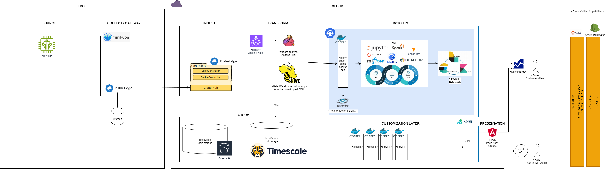

## Intro

Compare the IoT Architectures

### Context

#### Capabilities

Which capabilities are required?

- **ingest** the IoT data at high scale
  - protocoll MQTT
  - protocoll REST
- Device / Sensor **fleet-management**
- **life-processing** and reaction to time-series data 
- integrate with 3rd party enterprise-systems
  - Bulding Management System
- **vizualize** the data as graphs (consolidate as necessary)
- **partitioning** of data **by owners**
- northbound API access to data
- identify a **domain-model**
- **self service** (scope: only own device)
  - check device healthiness 
  - connect new devices south-bound
  - inspect vizualized data 
  - communicate 

#### Principles Building Scalable and Resilient Systems

Key Principles of Cloud-Native Architecture
1. Microservices: Breaking down applications into smaller, loosely coupled services that can be developed, deployed, and scaled independently.
2. Containers: Using lightweight, portable, and self-sufficient environments to ensure consistency across development, testing, and production.
3. DevOps: Integrating development and operations to streamline workflows, enhance collaboration, and accelerate delivery.
4. Continuous Delivery (CD): Automating the release process to ensure that software can be reliably released at any time.

<https://iotaci.com/blog/cloud-native-architecture-building-scalable-and-resilient-systems>

### Building Blocks

#### Reference > AWS Architecture > Event-driven reference architecture with IoT sensor data
Source <https://aws.amazon.com/blogs/architecture/building-event-driven-architectures-with-iot-sensor-data/>

#### Reference > AWS Architecture > Software-defined edge architecture for connected vehicles
Source <https://aws.amazon.com/blogs/architecture/software-defined-edge-architecture-for-connected-vehicles//>

#### Reference > AWS Architecture > Creating scalable architectures with AWS IoT Greengrass stream manager

Source <https://aws.amazon.com/blogs/architecture/creating-scalable-architectures-with-aws-iot-greengrass-stream-manager/>

#### Reference > AWS Architecture > Detect Real-Time Anomalies and Failures in Industrial Processes Using Apache Flink

Source <https://aws.amazon.com/blogs/architecture/detect-real-time-anomalies-and-failures-in-industrial-processes-using-apache-flink/>

#### CNCF IoT Architecture

Which open source tools can you use?

###### Edge from K8s

KubeEdge in Kuberentes to the Edge with Real-Workd Industry Use Case

##### CLOUD COLLECT/GATEWAY

 - **MicroK8s** https://microk8s.io/ by Canonical: A lightweight Kubernetes implementation that can run on resource-constrained devices at the edge.
 - **kubeedge** https://kubeedge.io/docs/ KubeEdge is an open source system for extending native containerized application orchestration capabilities to hosts at Edge. It is built upon kubernetes and provides fundamental infrastructure support for network, application deployment and metadata synchronization between cloud and edge. KubeEdge is licensed under Apache 2.0. and free for personal or commercial use absolutely.
   - Fleetmanagement on k8s

kube edge:

##### Warehouse / Analysis

- **Apache Hive & Spark SQL**:  These are open-source tools built on top of Apache Hadoop, a framework for distributed processing of large datasets. They offer great scalability and flexibility for data warehousing tasks, but require more technical expertise to set up and manage.

##### Machine learning open-source alternatives

For Experimentation and Model Management:

**MLflow**: This open-source platform focuses on managing the entire machine learning lifecycle, including experiment tracking, reproducibility, and model deployment. It offers functionalities like:
Tracking experiment parameters, metrics, and artifacts.
Packaging code for reproducibility.
Managing models across different frameworks (TensorFlow, PyTorch etc.)
For Model Deployment:

**Kubeflow**: Built on Kubernetes, Kubeflow provides a framework for building and deploying machine learning workflows. It offers features like:

- Standardizing ML application lifecycle on Kubernetes.
- Easy model deployment with containerization.
- Scalability for large deployments.

**BentoML**: This open-source platform excels at serving, managing, and deploying machine learning models. It simplifies packaging models for deployment and integrates with various frameworks for flexibility.

For Cloud-agnostic Training:

**Apache Spark**: This distributed processing framework allows you to train machine learning models on large datasets across clusters. While not a direct replacement for SageMaker's managed training environment, it offers powerful tools for scalable training.

**TensorFlow/PyTorch** on your own infrastructure: These popular deep learning frameworks provide the core functionalities for building and training machine learning models. You can set up your own compute infrastructure for training on the cloud provider of your choice or even on-premise.

Additional Considerations:

**Jupyter notebooks**: Both SageMaker and these open-source alternatives often leverage Jupyter notebooks for interactive development and experimentation.

**Cloud Integration**: While some options like Kubeflow require managing your own infrastructure, others like MLflow can be integrated with various cloud platforms for scalability and managed services.

The best open-source alternative depends on your specific needs. Consider factors like:

**Focus Area**: Are you primarily interested in experiment tracking, model deployment, or cloud-agnostic training?
Technical Expertise: How comfortable are you managing and configuring open-source tools?

**Cloud Integration**: Do you prefer a cloud-agnostic solution or integration with a specific cloud platform?

##### CLOUD INGEST

##### How CnCF things come together

Draft

kube edge:

### Conclusion

TODO

## Links

- <https://aws.amazon.com/blogs/architecture/building-event-driven-architectures-with-iot-sensor-data/>

