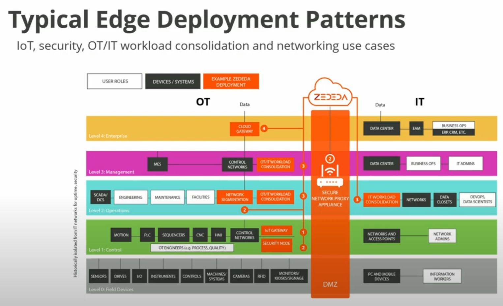
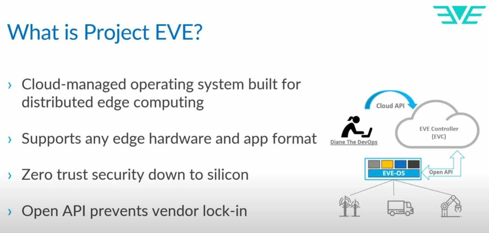

## Intro

Reserarch on https://zededa.com/

### Summary Zededa

- NICE: based on eve-os, open source, nice https://lfedge.org/projects/eve/
  - eve-os update itself
- AVAILABLE: docker on edge - very important. Make the whole setup extendable
- AVAILABLE: immutable Linux distribution!
- AVAILABLE: Rollback capabilities!

#### Eve OS - avoid vendor lock in

Architecture Eve OS <https://lfedge.org/projects/eve/>

Derived from automation pyramid
<https://integrated-controls.com/wp-content/uploads/2024/03/image1-31-1024x630.png>
https://integrated-controls.com/what-are-the-5-levels-of-automation/

#### Eve OS - open api available

##### Open Questions
- scaleability on edge to multiple machines to achieve High availability on edge? Unlear
			The write about Kubernetes on edge, but not clear how far they are
- are there APIs for the fleet management and integration?
- available apps for local GUIs?

## Glossary 

| Component                           | Explanation                                                                                                                                                                                                                                               |
|-------------------------------------|-----------------------------------------------------------------------------------------------------------------------------------------------------------------------------------------------------------------------------------------------------------|
| PLC (Programmable Logic Controller) | A digital computer designed for industrial control, replacing traditional relay logic. It handles tasks like sequencing, timing, counting, and data manipulation.                                                                                         |
| CNC (Computer Numerical Control)    | A system that uses computer software to control machine tools, directing their movements to produce parts with precision. It's often used for milling, turning, drilling, and routing.                                                                    |
| HMI (Human-Machine Interface)       | A device that allows operators to interact with and control machines or processes. It often features a touchscreen display with buttons, sliders, and other input elements, providing a user-friendly interface for monitoring and controlling equipment. |
| **EAM (Enterprise Asset Management)** | Managing physical assets throughout their lifecycle. | Asset tracking, maintenance scheduling, work order management, inventory control, depreciation calculations. | Manufacturing, utilities, transportation, healthcare. |
| **ERP (Enterprise Resource Planning)** | Integrating and automating business processes across departments. | Financial management, human resources, supply chain management, customer relationship management, manufacturing. | Manufacturing, retail, wholesale, distribution. |
| **CRM (Customer Relationship Management)** | Managing interactions with customers and potential customers. | Sales force automation, marketing automation, customer service, contact center management. | Sales, marketing, customer service. |

## Links

- https://zededa.com/
- 

