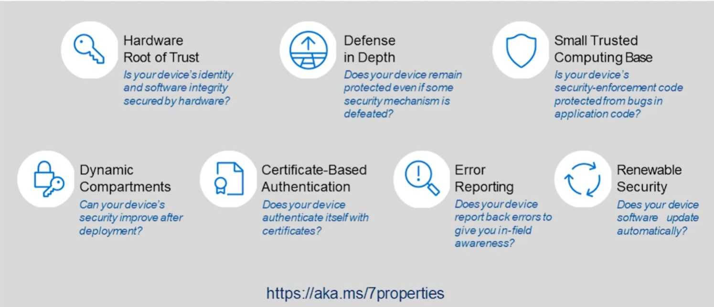
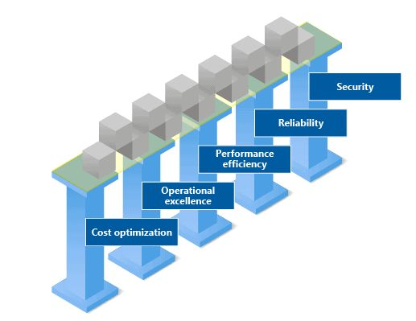
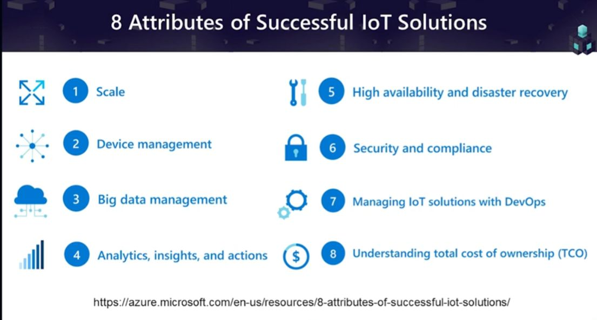
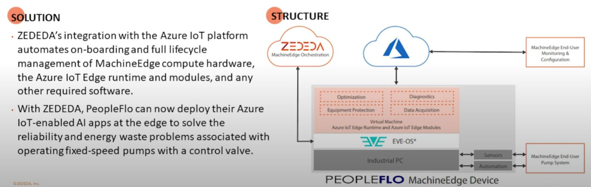
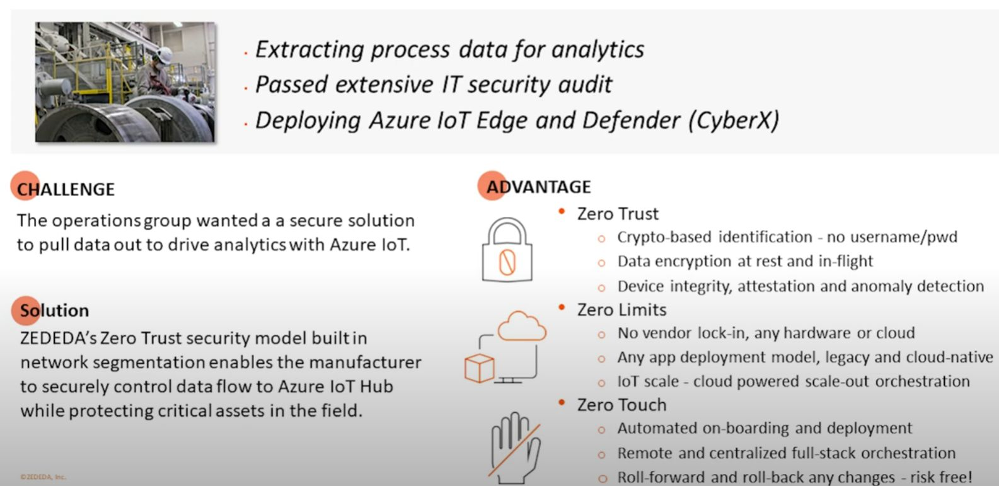
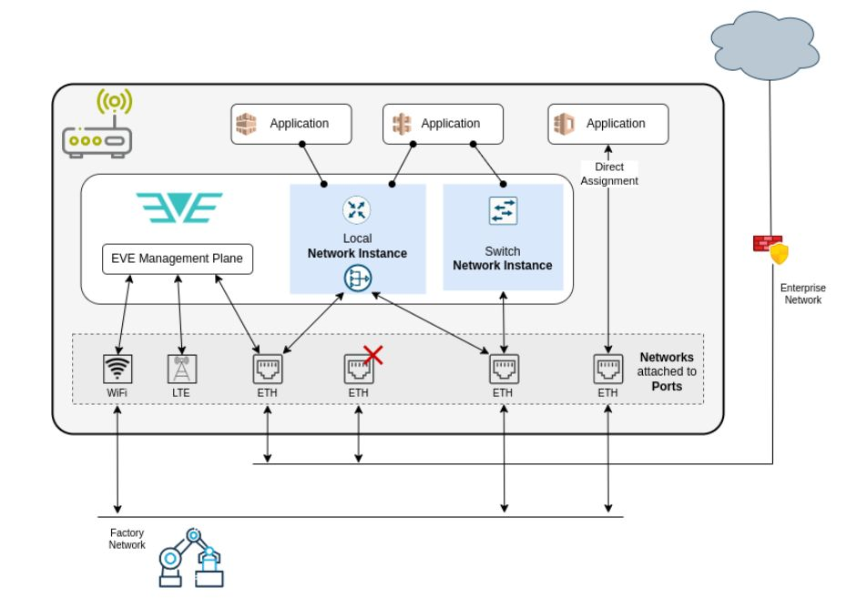

## Intro

### Summary Architecture

Read upon 7-5-8

**7 properties of secure devices**
From <https://www.youtube.com/watch?v=wUregYV7Y7Y>

<https://www.microsoft.com/en-us/research/uploads/prod/2020/11/Seven-Properties-of-Highly-Secured-Devices-2nd-Edition-R1.pdf>

**5 pilars of well architected framework** 

<https://learn.microsoft.com/en-us/azure/well-architected/iot/iot-cost-optimization>

<https://learn.microsoft.com/en-us/azure/well-architected/iot/iot-overview?wt.mc_id=techcomm_wablog_blog_azuremktg>

**8 Attributes of Succesfuly IoT Solutions**

<https://azure.microsoft.com/en-us/resources/8-attributes-of-successful-iot-solutions/>

### Deploying Zededa OS

<https://query.prod.cms.rt.microsoft.com/cms/api/am/binary/RW1okgr>

source <https://www.youtube.com/watch?v=wUregYV7Y7Y>

### zededa built in network segmentation

<https://github.com/lf-edge/eve/blob/master/docs/NETWORKING.md>

### zededa And Azure IoT integration

## Links

- https://zededa.com/
- 

