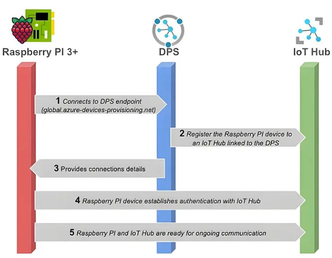
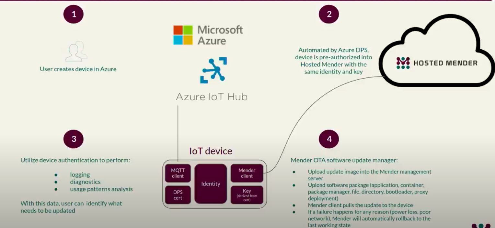

## Intro

### Capabilities

Which capabilities do you need on edge for IoT-Devices?

 - Device management

   - **Device provisioning**: Simplifies the process of adding new devices to the IoT Hub, including authentication and security configuration.
   - **over-the-air updates for your IoT devices**: Enables the deployment of firmware and software updates to devices over-the-air, ensuring that they are always up-to-date.   

### Azure 

#### Device Provisioning Service

   
<https://medium.com/globant/devices-enrollment-to-azure-iot-hub-using-azure-device-provisioning-service-dps-027d50bac81a>

### Device Update for IoT Hub - over the air

Open Source solution from "mender.io"

 - Image-based updates
 - Package-based updates

 - <https://learn.microsoft.com/en-us/azure/iot-hub-device-update/understand-device-update>
 - <https://mender.io/>

Mender SaaS "hosted Mender" offers the integration with Azure.

## Links

- <https://mender.io/>
- 

