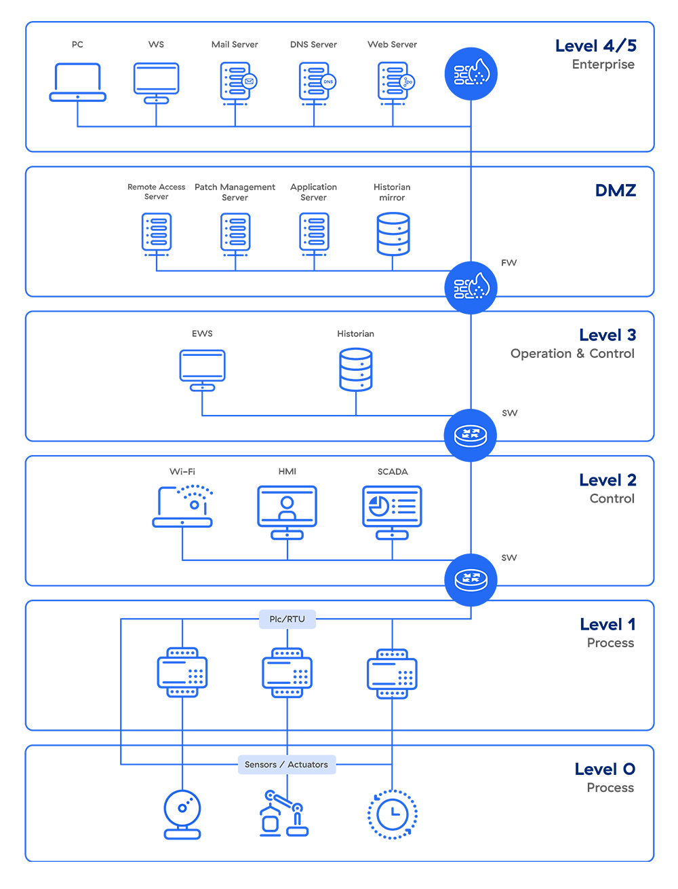

## Intro

### Purdue Model

What’s the Purpose of the Purdue Model?
The Purdue model, part of the Purdue Enterprise Reference Architecture (PERA), was designed as a reference model for data flows in computer-integrated manufacturing (CIM), where a plant’s processes are completely automated. It came to define the standard for building an ICS network architecture in a way that supports OT security, separating the layers of the network to maintain a hierarchical flow of data between them.

The model shows how the typical elements of an ICS architecture interconnect, dividing them into six zones that contain information technology (IT) and OT systems. Implemented correctly, it helps establish an “air gap” between ICS/OT and IT systems, isolating them so an organization can enforce effective access controls without hindering business.

Zones of the Purdue Model
OT systems occupy the lower levels of the model while IT systems occupy the upper levels, with a “demilitarized zone” of convergence between them.

Let’s take a look at each of the zones in the Purdue reference model, top to bottom.

### Measures for IT OT convergence

#### Segmentation Remains A Valid Concept

While hyperconvergence has rendered the Purdue Model all but obsolete, the concepts behind it remain valid. While it's not realistic to think that all OT systems can be completely disconnected from other networks, it is possible to monitor and regulate the communications that must take place.

#### Visibility Across IT, IoT And OT

The first step toward that goal is by establishing comprehensive visibility into all devices in an enterprise's technology infrastructure and then monitoring device behavior. This means visibility across the converged IT and OT environment. 

#### One Converged Security Team

Finally, in a converged IT and OT environment, security teams need to reconsider their management and reporting structure. Siloed physical security, OT security, IT security and supply chain teams need to be reorganized to ensure an effective security strategy that spans IT and OT environments. 

 - <https://www.forbes.com/councils/forbestechcouncil/2022/01/18/a-reimagined-purdue-model-for-industrial-security-is-possible/>

## Links

- <https://www.zscaler.com/resources/security-terms-glossary/what-is-purdue-model-ics-security>
- 

## Glossary

### Fieldbus

