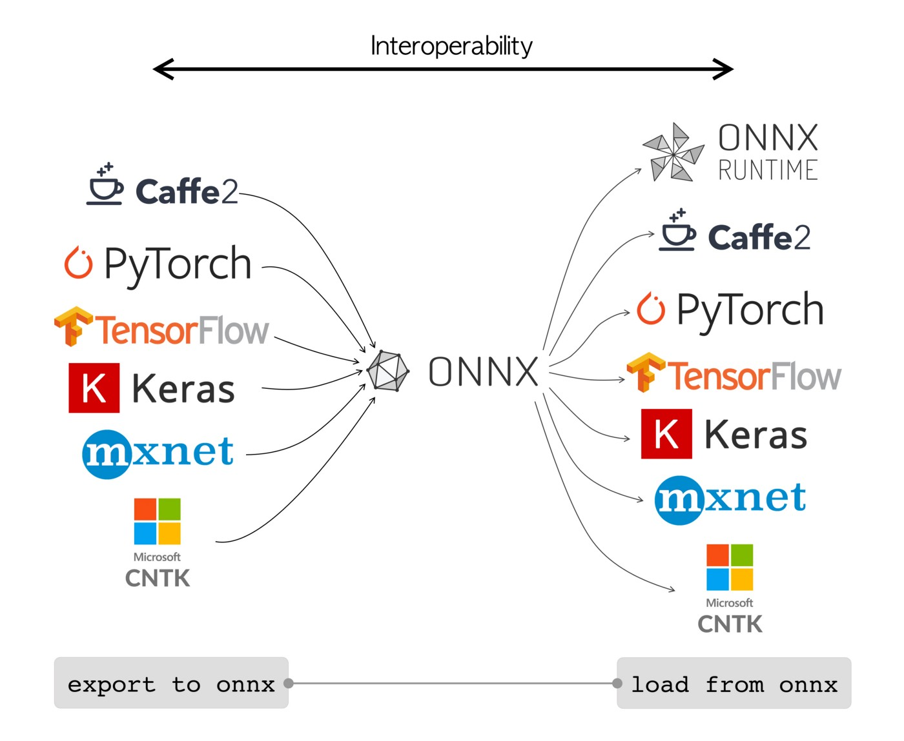

## Intro

This is my overview of the AI universum.

## Courses
 
Helpful comprehensive courses

 - 

## Tutorials

- [Building an In-House LLM Application with Spring AI and Ollama: A Comprehensive Tutorial](https://delta-dev-software.fr/building-an-in-house-llm-application-with-spring-ai-and-ollama-a-comprehensive-tutorial)
- [Detect objects with Raspberry Pi using Google Coral Edge TPU](https://anttihavanko.medium.com/detect-objects-with-raspberry-pi-using-google-coral-edge-tpu-15f9a46c317a)
- [ML AI Models](https://viso.ai/deep-learning/ml-ai-models/)

## How to execute models

The tools in the table (Llama.cpp, TensorFlow Lite, etc.) are the **engines**. They're what actually perform the LLM computations.

### Tools Suitable for Local Experiments on Desktop Machines

| Tool          | Description                                                 | Key Features                                             | OS Support                                      | LLM Format Support                                    | Comparison Criteria                                                                                                                                                                                                                    |
|---------------|-------------------------------------------------------------|----------------------------------------------------------|-------------------------------------------------|-------------------------------------------------------|----------------------------------------------------------------------------------------------------------------------------------------------------------------------------------------------------------------------------------------|
| **LM Studio** | GUI-based tool for running and fine-tuning language models. | - Intuitive interface  - Supports multiple models     | Windows, macOS, Linux (likely via Wine/similar) | GGML, GPTQ, and others (check specific model support) | - **Hardware compatibility:** Good (depends on the model)  - **Ease of use:** High (user-friendly interface)  - **Model support:** Wide range, check compatibility  - **Performance:** Good  - **Customization:** Moderate |
| **Ollama**    | Platform offering pre-packaged LLMs ready to run locally.   | - Minimal setup required  - Out-of-the-box solutions  | macOS (native), Linux (Docker), Windows (WSL)   | Varies by model; often GGML or similar quantizations  | - **Hardware compatibility:** Good (depends on the model)  - **Ease of use:** High (very easy setup)  - **Model support:** Pre-packaged LLMs  - **Performance:** Good  - **Customization:** Limited                        |
| **LocalAI**   | Tool for running various LLMs locally.                      | - Broad compatibility and support  - Strong community | Linux, macOS, Windows (Docker-based)            | GGML, GPTQ, and others (check specific model support) | - **Hardware compatibility:** Good (depends on the model)  - **Ease of use:** Moderate  - **Model support:** Wide range of models  - **Performance:** Good  - **Customization:** Moderate                                  |

### Tools Potentially Suitable for Resource-Constrained/Edge Deployments

| Tool                             | Description                                                                       | Key Features                                                                                                                | OS Support                                                    | LLM Format Support                                           | Comparison Criteria                                                                                                                                                                                                                                                             |
|----------------------------------|-----------------------------------------------------------------------------------|-----------------------------------------------------------------------------------------------------------------------------|---------------------------------------------------------------|--------------------------------------------------------------|---------------------------------------------------------------------------------------------------------------------------------------------------------------------------------------------------------------------------------------------------------------------------------|
| **Llama.cpp**                    | Open-source tool for running Llama-based models efficiently on local hardware.    | - Works on GPUs and CPUs  - Lightweight and resource-friendly                                                            | Linux, macOS, Windows                                         | GGML (GGML quantizations), potentially others via conversion | - **Hardware compatibility:** Excellent (GPUs and CPUs)  - **Ease of use:** Moderate (requires some technical knowledge)  - **Model support:** Primarily Llama-based, but expanding  - **Performance:** Efficient  - **Customization:** High                        |
| **GPT4All**                      | Tool for running GPT models locally.                                              | - Pre-trained GPT models  - Efficient on standard hardware (even CPUs)                                                   | Windows, macOS, Linux                                         | GPT4All format, often based on GGML                          | - **Hardware compatibility:** Excellent (CPUs and GPUs)  - **Ease of use:** Moderate  - **Model support:** GPT models  - **Performance:** Good  - **Customization:** Moderate                                                                                       |
| **TensorFlow Lite (now LiteRT)** | TensorFlow's framework for deploying models on mobile, embedded, and IoT devices. | - Model optimization and quantization  - Supports various hardware accelerators  - Designed for low latency inference | Android, iOS, Linux, macOS, Windows (and other embedded OSes) | TensorFlow Lite (.tflite)                                    | - **Hardware compatibility:** Excellent (mobile, embedded, and desktop)  - **Ease of use:** Moderate (requires TensorFlow knowledge)  - **Model support:** TensorFlow models (converted to .tflite)  - **Performance:** Highly optimized  - **Customization:** High |

### Formats of models

| Format Name                         | File Extensions(s)                   | Description                                                                                                               | Strengths                                                        | Common Use Cases                                      |
|-------------------------------------|--------------------------------------|---------------------------------------------------------------------------------------------------------------------------|------------------------------------------------------------------|-------------------------------------------------------|
| ONNX (Open Neural Network Exchange) | `.onnx`                              | Designed for interoperability between frameworks. Stores model structure and weights.  | Portability, framework-agnostic                                  | Model exchange, deployment across platforms           |
| TensorFlow SavedModel               | (Directory)                          | TensorFlow's native format. Includes weights, architecture, and metadata.                                                 | Comprehensive, well-integrated with TensorFlow ecosystem         | TensorFlow Serving, deployment                        |
| TensorFlow Lite                     | `.tflite`                            | Optimized for mobile, embedded, and IoT devices. Supports quantization.                                                   | Efficiency on resource-constrained devices, quantization support | Mobile apps, embedded systems, IoT devices            |
| Keras                               | `.keras` (preferred), `.h5` (legacy) | While Keras is an API, it has its own saving conventions.  `.keras` is the newer, more comprehensive format.              | Simplicity, integration with Keras API                           | Model saving and loading in Keras workflows           |
| TorchScript                         | `.pt`, `.pth` (used within), `.ts`   | PyTorch's format for serializing models.  `.ts` is the TorchScript format.                                                | Deployment, especially in production environments, C++ inference | Production PyTorch deployments, mobile (via LibTorch) |
| safetensors                         | `.safetensors`                       | A safe and efficient way to store and transfer tensors, particularly weights.                                             | Security (avoids pickle risks), efficiency                       | Sharing and deploying LLMs, general model storage     |

### Specialized models

| Category                        | Specialized Model Example                             | Description                                                                              | Key Focus                                         |
|---------------------------------|-------------------------------------------------------|------------------------------------------------------------------------------------------|---------------------------------------------------|
| **Computer Vision**             | Bird Species Identification Model                     | Classifies images of birds into specific species.                                        | Accuracy on bird species classification           |
|                                 | Facial Expression Recognition Model                   | Detects and classifies human facial expressions (e.g., happy, sad, angry).               | Accuracy on emotion recognition                   |
|                                 | Defect Detection in Manufacturing                     | Identifies flaws or imperfections in products on a production line.                      | Speed and accuracy of defect detection            |
| **Natural Language Processing** | Sentiment Analysis for Customer Reviews               | Determines the sentiment (positive, negative, neutral) expressed in customer reviews.    | Accuracy on sentiment classification              |
|                                 | Medical Text Summarization                            | Generates concise summaries of medical reports or research papers.                       | Accuracy and relevance of summaries               |
|                                 | Chatbot for a Specific Product or Service             | Answers customer questions related to a particular product or service.                   | Accuracy and helpfulness of responses             |
| **Audio/Speech**                | Speech Recognition for a Specific Language/Dialect    | Transcribes spoken language in a particular language or dialect.                         | Accuracy on specific language/dialect recognition |
|                                 | Music Genre Classification                            | Classifies music tracks into different genres.                                           | Accuracy of genre classification                  |
| **Healthcare**                  | Disease Detection in Medical Images                   | Detects specific diseases or conditions (e.g., cancer) in medical images (X-rays, MRIs). | Accuracy and sensitivity of disease detection     |
|                                 | Drug Discovery Model for a Specific Target            | Predicts the effectiveness of drug candidates against a specific biological target.      | Accuracy of target prediction                     |
| **Finance**                     | Fraud Detection Model for Credit Card Transactions    | Identifies potentially fraudulent credit card transactions.                              | Accuracy and speed of fraud detection             |
|                                 | Risk Assessment Model for Loan Applications           | Assesses the creditworthiness of loan applicants.                                        | Accuracy of risk prediction                       |
| **Manufacturing**               | Predictive Maintenance Model for Industrial Equipment | Predicts when specific pieces of equipment will require maintenance.                     | Accuracy of maintenance prediction                |
|                                 | Quality Control Model for Product Manufacturing       | Identifies defects or variations in manufactured products.                               | Accuracy and speed of quality control             |

## The Hardware

### For Tensorflow
A USB accessory that brings accelerated ML inferencing to existing systems. Works with Linux, Mac, and Windows systems.

<https://coral.ai/products/accelerator/>

TensorFlow Lite focus: The Coral Edge TPU, the chip inside the USB Accelerator, is primarily designed to accelerate TensorFlow Lite models.

PyTorch's ecosystem: PyTorch has its own ecosystem and model formats. Different from tensorflow.

### For PyTorch
The NVIDIA® Jetson Nano™ 2GB Developer Kit

Can run **PyTorch** models more directly, especially with its powerful GPU. Especially **EdgeFace**.

Has tools for converting to formats like TensorRT for NVIDIA hardware.

<https://developer.nvidia.com/buy-jetson?product=all&location=DE>

<https://www.reichelt.de/de/de/shop/produkt/nvidia_jetson_orin_nano_bundle_6x_1_5_ghz_4_gb_ddr5-349355>

## How to deploy models

Deploying in docker

## Glossary

| Key                                              | Explanation                                                                                                                                                                                                                                                                                                                                                                                                                                        |
|--------------------------------------------------|----------------------------------------------------------------------------------------------------------------------------------------------------------------------------------------------------------------------------------------------------------------------------------------------------------------------------------------------------------------------------------------------------------------------------------------------------|
| An LLM, or Large Language Model                  | An LLM, or Large Language Model, is a type of artificial intelligence (AI) model designed to understand, generate, and translate human language.  They are "large" because they are trained on massive datasets of text and code, often containing billions or even trillions of words. This vast training data allows them to learn the complex patterns and structures of language.  Examples of LLMs: GPT models (e.g., GPT-3, GPT-4) BERT PaLM |
| A general deep learning model                    | A general deep learning model is a computational model that learns complex patterns from data using multiple layers of artificial neural networks.  The "deep" in deep learning refers to the multiple layers, which allow the model to learn hierarchical representations of the data.  These models are designed to handle a wide variety of tasks and data types, making them "general"                                                         |
| Specialized Models, Task-Specific Models         | This is a straightforward and commonly used term                                                                                                                                                                                                                                                                                                                                                                                                   |
| Lightweight Models, Edge Models, Embedded Models | This often refers to smaller, more efficient models that can be deployed on resource-constrained devices. Similar to lightweight models, but with a focus on deployment on edge devices (e.g., mobile phones, IoT devices)                                                                                                                                                                                                                         |
| Face Recognition Models                          | Some (**YOLO**) models are the most fundamental. They are trained to identify if there are faces present in an image and, if so, where those faces are located.  Others lie "**FaceNet**", "**EdgeFace**" not only detect faces but also identify them.                                                                                                                                                                                            |
| ultralytics                                      | <https://docs.ultralytics.com/de/integrations/onnx/#onnx-and-onnx-runtime> Ultralytics is a company that specializes in developing and providing cutting-edge computer vision solutions, particularly in the field of object detection. They are best known for their work on the YOLO (You Only Look Once) family of object detection models.                                                                                                     |