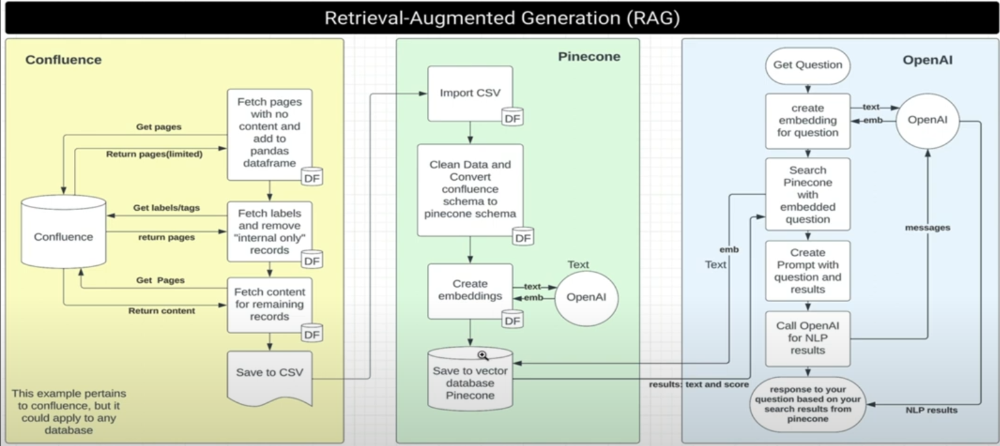
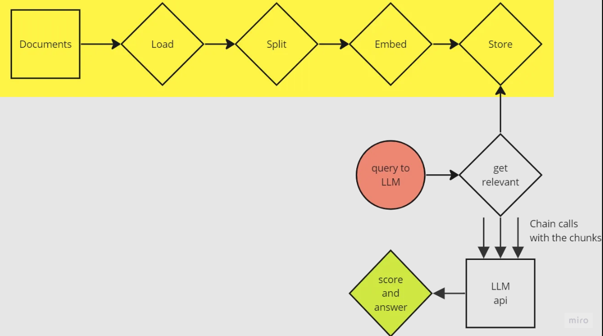

## Intro

If you wanna manage** knowledge** in our company, so that 

- the Role **Role: Customer** <br>
  in a **App: Helpdesk**  <br>
  can <br>
  - use **Capability:search** and find content at anytime
  - use a **Capability:chatbot** and ask questions

- the Role **Role: Support employee** <br>
  in a **App: knowledgeDB** <br>
  can <br>
  -  add content as **Template: runbook** and **Template: FAQ** to **Capability: KnowledgeDB**, as part of <br> <br> "ITILs Closure: Once the incident is resolved and the service is restored, the incident is closed. "

- the Role **Role: Developer** <br>
  in an **App: knowledgeDB** <br>
  can
  - add documentation in **Template:service_markdown** 


## Option1: Handcrafted solution. use Confluence as knowledgeDB

One can manage the knowledge data in Confluence.

But the extraction of the unnecessarily complex.


 - Thats the path only for the **Capability:chatbot**
 - The problem is - with the unstructured content on confluence.

 


<https://www.youtube.com/watch?v=zjdFOwBxBRo>


## Option2: Handcrafted solution. Use Git as Knoledge DB

One can manage the knowledge data in Git, in Markdown.

<https://medium.com/@dinber19/creating-your-own-q-a-chatbot-over-your-markdown-documents-using-langchain-11645bc346bc>


This is how to works

#### Configure 
  - choose **text-embedding-ada-002** is a text embedding model developed by OpenAI. It's designed to convert text into numerical representations (vectors) that capture the semantic meaning of the text. These vectors can then be used for various natural language processing tasks, such as search and chat
  - choose a vector DB "**Weaviate**" to store the data, ready for queries
 
#### Load and Split documents and generate embeddings and store
  -  use Unstructured library implemented in **LangChain**. <br>
  LangChain facilitating interaction between LLMs and the environment
  - the result is stored in vector DB **Weaviate**

 ####  Query the LLM usingthe vector DB
   - use **AzureOpenAI** to query

####  GUI
  - use "Azure AI Bot Service" <https://learn.microsoft.com/en-us/azure/bot-service/bot-service-design-pattern-embed-web-site?view=azure-bot-service-4.0>
  - Embed bot into the documentation page <https://github.com/squidfunk/mkdocs-material/issues/1804>
  - Connect a bot to Web Chat <https://learn.microsoft.com/de-de/azure/bot-service/bot-service-channel-connect-webchat?view=azure-bot-service-4.0#get-your-bot-secret-key>





**Advantage**: the linting of the markdown gives one the quality assurance

```
  # Runbook Title

  ## Overview
  Provide a brief description of the runbook's purpose and scope.

  ## Prerequisites
  List any prerequisites or requirements needed before executing the runbook.

  ## Steps
  1. **Step 1: Description**
    - Detailed instructions for Step 1.
    - Include any necessary commands or code snippets.

  2. **Step 2: Description**
    - Detailed instructions for Step 2.
    - Include any necessary commands or code snippets.

  3. **Step 3: Description**
    - Detailed instructions for Step 3.
    - Include any necessary commands or code snippets.

  ## Troubleshooting
  Provide common issues and their solutions.

  ## Contact Information
  List the contact information for support or escalation.

  ## Version Control
  - **Version:** 1.0
  - **Last Updated:** YYYY-MM-DD
  - **Updated By:** Name

  ## References
  Include any references or links to additional resources.


```


**Cost**: Free to low, for AI queries. Like 15$ for 1 Million tokens <https://azure.microsoft.com/en-us/pricing/details/cognitive-services/openai-service/>


## Option3: Some Buy solution like zendesk.de

Like 
<https://www.zendesk.de/>

- Messaging and live chat
- AI and automation
- Data privacy and protection
- Help center
- Agent workspace
- VoiceNew
- Workforce engagement


**Disadvantage**: data lives outside the company

**Cost**: 55EUR per 2nd level per Month. like 3000 EUR yearly
<https://www.zendesk.de/pricing/>


