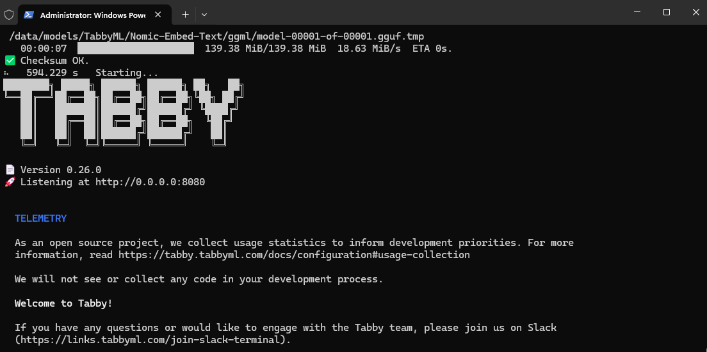
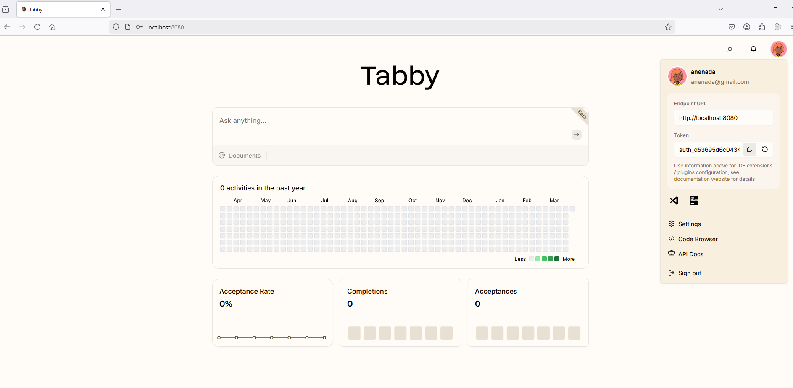
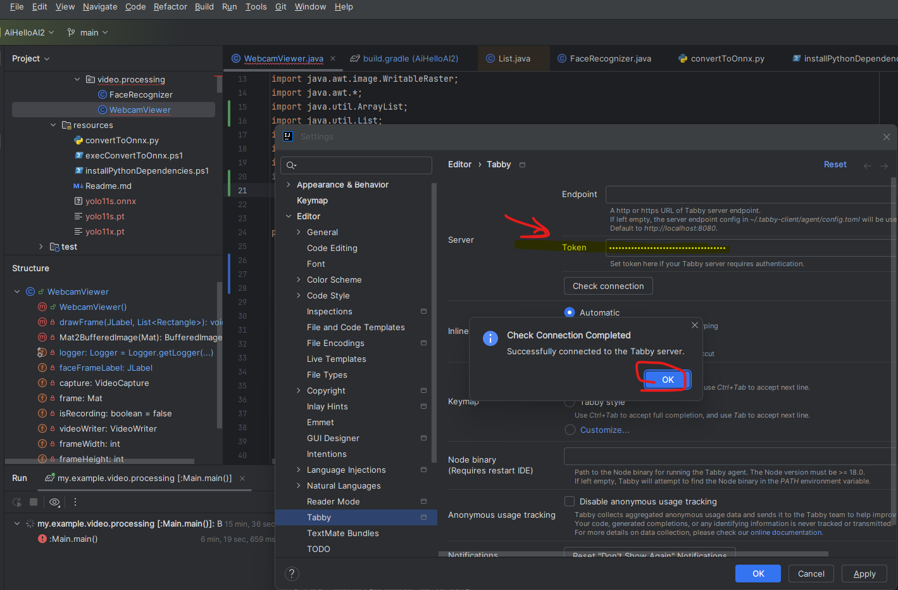

## Intro

AI coding assistants.
Collection.

Commercial, Open source.
LLM or plugin.


## LLM

Chat with the machine 

### Online 

#### Open Source 

##### HuggingChat

<https://huggingface.co/chat/>

### Offline

#### Open Source 

##### Jan.ai

<https://jan.ai/>


## Commercial 

<https://gemini.google.com/chat>

<https://copilot.microsoft.com/>


## COding assistants - AI powered

AI-powered coding assistants have become increasingly popular. GitHub Copilot, developed by GitHub in collaboration with OpenAI, has been at the forefront of this revolution. However, for those seeking open-source alternatives, there are several impressive options available.

<https://sebastian-petrus.medium.com/top-10-open-source-github-copilot-alternatives-2024-version-70fbf89753d6>

### Offline

#### Open Source 

##### Tabby

Has Idea Community integration.

```
Set-Location ~
docker run -it --gpus all -p 8080:8080 -v $HOME/.tabby:/data tabbyml/tabby serve --model StarCoder-1B --device cuda --chat-model Qwen2-1.5B-Instruct
```

Then use the URI in browser to set up the server

 
 
 


<https://github.com/TabbyML/tabby>

##### Llama Coder

<https://github.com/ex3ndr/llama-coder>


### Online

#### Commercial

##### CodeWhisperer

<https://docs.aws.amazon.com/codewhisperer/latest/userguide/what-is-cwspr.html>

##### Cursor AI

<https://www.cursor.com/>

- AI-Powered Coding Assistant: Cursor uses advanced AI models to provide intelligent code suggestions, completions, and even entire function implementations.
- Chat Interface: One of Cursor’s standout features is its integrated chat interface. You can ask questions about your code, request explanations, or even ask for help with specific coding tasks directly within the editor.
- Code Refactoring: Cursor can help you refactor your code, suggesting improvements and optimizations to make your codebase more efficient and maintainable.
- Multi-Language Support: Like Copilot, Cursor supports a wide range of programming languages, making it versatile for different types of projects.
Context-Aware Suggestions: Cursor analyzes your entire codebase to provide more accurate and relevant suggestions, taking into account the context of your project.
- Customization: You can fine-tune Cursor’s behavior to match your coding style and preferences.
Privacy-Focused: Unlike some cloud-based solutions, Cursor prioritizes privacy by running locally on your machine, ensuring your code doesn’t leave your system.
- Regular Updates: The Cursor team actively develops the tool, regularly adding new features and improvements based on user feedback.
Free Tier Available: While Cursor offers paid plans for additional features, there’s also a free tier available for individual developers.
- IDE Integration: Cursor can be integrated with popular IDEs, allowing you to use its features within your preferred development environment.