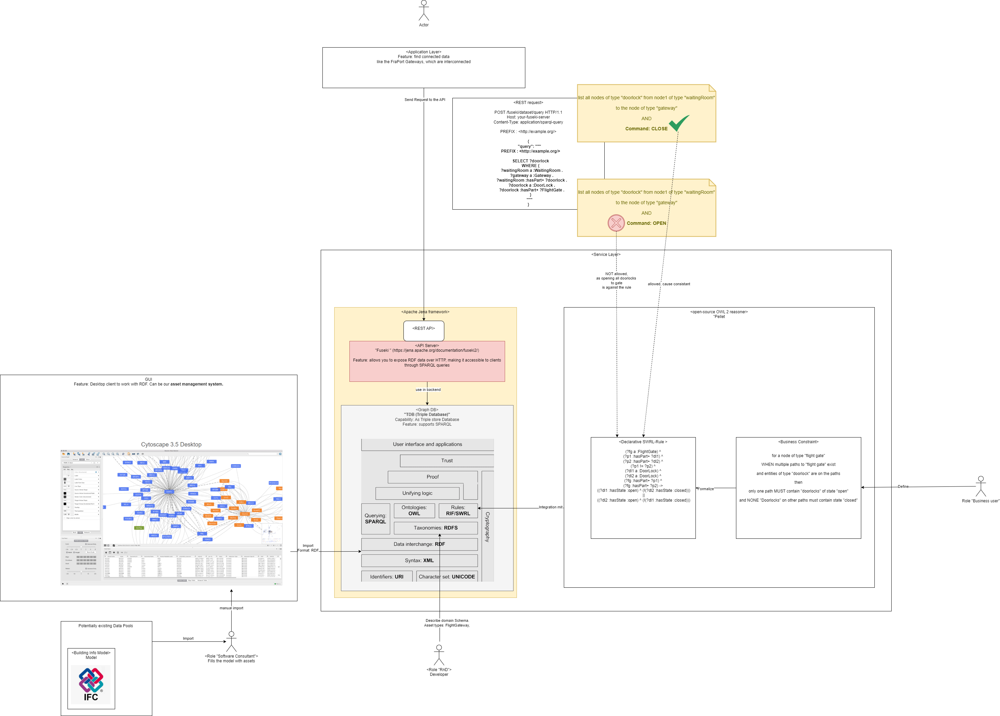

## Intro

Comparison 2D geometry.

## Problem

###  Maintenance of Semantic 2D Floorplans (Online / Offline)

- Data acquisition methods (including digitization and AI-powered semantic annotation)
- intuitive user interface enabling geometric and semantic editing.

### Metadata. 

##### Metadata. Integrating the Knowledge Graph with Floorplan Visualizations
  The true power of the semantic floorplan system is realized when the **knowledge graph is seamlessly integrated with the visual representation**, allowing users to interact with and understand the data intuitively.

  - Linking Visual Elements (e.g., SVG IDs, GeoJSON Feature IDs) to Knowledge Graph Nodes
    A robust and consistent linking mechanism between the visual elements on the floorplan and their corresponding semantic entities in the knowledge graph is fundamental.
    
  - **Knowledge Graph Node IDs:** The nodes in the knowledge graph representing these building elements (spaces, assets) must also use these same unique identifiers.

  This consistent use of identifiers creates a direct bridge: a click on an SVG element yields its ID, which is then used to query the knowledge graph for associated semantic information. 
  

##### Metadata. Spatial Graph.

Spatial graph describes the shape of spaces, as well as their adjacency and connectivity. Edge elements and boundary elements reference edges.

<https://developers.archilogic.com/space-graph/spatial-graph>

##### Metadata. Assets

Ability to model assets on the 2D map

##### Metadata. Spaces

Ability to find spaces, interactions between spaces.

###  Offline Floorplan Export and Programmatic Access

- packaging floorplans and their associated semantic data for offline use

###  Offline Viewer

-  2D renderer of the exported format

### Traversable Knowledge Graph for Enhanced Floorplan Intelligence

- modeling of the **knowledge graph** 
- approaches for implementing and **querying this graph** offline and its integration with the **visual floorplan representations**

The API should expose a clear and intuitive set of functions for retrieving and interacting with the floorplan data. 

Examples of such API methods include:

-   `getFloorplanGeometry(floorId: string)` : Promise<GeoJSONFeatureCollection>`: Retrieves the geometric data for all elements on a specified floor, perhaps as a GeoJSON FeatureCollection.
-   `getElementProperties(elementId: string): Promise<Object>`: Fetches all semantic properties for a given space or asset ID from the knowledge graph.
-   `getRelatedElements(elementId: string, relationshipType: string, direction: 'incoming' | 'outgoing' | 'both'): Promise<Array<Object>>`: Finds elements connected to a given element by a specific relationship type (e.g., `fp:containsElement`, `fp:connectedTo`).
-   `findElementsBySemanticType(typeURI: string): Promise<Array<Object>>`: Returns all elements (spaces or assets) of a given semantic type.
-   `findElementsByPropertyValue(propertyURI: string, value: any): Promise<Array<Object>>`: Searches for elements that have a specific property with a given value.
-   `getShortestPath(startElementId: string, endElementId: string): Promise<Array<string>>`: If a navigation graph is pre-calculated or can be queried, this returns a sequence of space/node IDs representing the shortest path.

Internally, these API methods would construct and execute appropriate QUERY LANGUAGE queries (potentially using recursive Common Table Expressions for graph traversals like pathfinding or hierarchical queries against the SQLite tables within the GeoPackage. 

 

## Solutions Space

###  Maintenance of Semantic 2D Floorplans (Online / Offline)
TODO

###  Offline Floorplan Export and Programmatic Access

Option1: 

###  Maintenance of Semantic 2D Floorplans (Online / Offline)

### Metadata. 

#### Metadata. Integrating the Knowledge Graph with Floorplan Visualizations
  
  

##### Metadata. Spatial Graph.

##### Metadata. Assets

##### Metadata. Spaces

###  Offline Floorplan Export and Programmatic Access

###  Offline Viewer

### Traversable Knowledge Graph for Enhanced Floorplan Intelligence