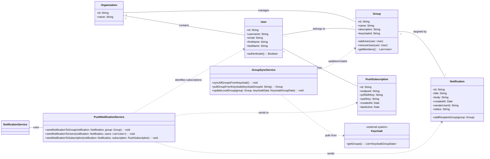

## Intro

Own, self hosted management service for push messages.

###### Backend API for Subscription Management

<https://ntfy.sh/>

Der ntfy.sh-Dienst selbst ist ein Server. Er ist dafür zuständig, Nachrichten von Absendern (Publishers) entgegenzunehmen, sie zu speichern und an die entsprechenden Abonnenten (Subscribers) weiterzuleiten.
Wenn Sie den öffentlichen ntfy.sh-Server nutzen (also ntfy.sh als URL für Ihre Nachrichten), dann senden Sie Ihre Daten an diesen Server.

❌ typically for individual or small-scale use, not for multi-user or enterprise-grade environments 

<https://github.com/gotify/server>

We wanted a simple server for sending and receiving messages (in real time per WebSocket). For this, not many open source projects existed and most of the existing ones were abandoned. Also, a requirement was that it can be self-hosted. We know there are many free and commercial push services out there.

<https://docs.novu.co/platform/what-is-novu>

The open-source notification infrastructure that simplifies in-app, email, chat, and push notifications.

Novu is an open-source notification infrastructure built for anyone who needs an easy way to implement, manage, and deliver notifications across multi-channels, including in-app, email, chat, push, and SMS.

<https://github.com/naturalprogrammer/webpush-java-demo

Lib to build a push notification management backend using  `java-web-push` 

However, it's crucial to understand the implications, especially for an "enterprise environment with multi-tenancy support."

###### What `java-web-push` (or similar libraries) provides:

`java-web-push` (or any other Web Push library) is designed to handle the **technical complexities** of the Web Push Protocol:

* **VAPID Key Management:** Generating and using your VAPID public/private key pair to sign your push requests.
* **Payload Encryption:** Encrypting the message content before sending it to the browser's Push Service, ensuring only the browser can read it.
* **HTTP Requests to Push Services:** Making the actual HTTP POST requests to the browser's `endpoint` URL (Google's, Mozilla's, Apple's services).
* **Error Handling:** Providing structured error responses (e.g., HTTP 410 Gone for expired subscriptions) so you can manage your stored subscriptions.

###### What `java-web-push` (or similar libraries) *does NOT* provide out-of-the-box:

This is where Novu and other full-fledged notification platforms come in. When you choose to use just a library, you're responsible for implementing all the **application-level logic** yourself:

1.  **Subscription Management API:**
    * **Saving Subscriptions:** You need to create your own REST API endpoint (e.g., `/api/subscribe`) in your Java backend where your Angular app can send the `PushSubscription` object.
    * **Database Schema:** You'll design your own database schema to store these `PushSubscription` objects, typically linked to your authenticated user IDs.
    * **Unsubscription Logic:** An endpoint (e.g., `/api/unsubscribe`) for when users opt out, and automated logic to remove subscriptions if push services return a `410 Gone` status.
    * **Permission Handling:** Your Angular app needs to manage the UI for asking permission and handling user choices.

2.  **User Authentication & Authorization Integration:**
    * Your Angular application will need to authenticate users against your existing authentication system.
    * When a user subscribes, you'll associate their `PushSubscription` with their authenticated user ID in your database.
    * When sending a notification, you'll retrieve subscriptions based on the target user's ID.

3.  **Multi-Tenancy Support:** This is the most significant part you'll have to build:
    * **Tenant Identification:** Your backend needs to know which tenant a request belongs to (e.g., via a JWT claim, a header, or a URL segment).
    * **Data Isolation:** Your database schema for `PushSubscription` objects must include a `tenant_id` column, and all queries to retrieve or store subscriptions must filter by the active tenant.
    * **VAPID Key Isolation (Optional but sometimes desired):** You might choose to have a separate VAPID key pair per tenant for stricter isolation, which means your backend would need to load the correct VAPID keys based on the tenant. (More complex, often a single VAPID key pair for the entire application is sufficient and simpler).
    * **Tenant-Specific Logic:** If different tenants have different notification preferences or rules, you'll need to implement that logic.

4.  **Notification Triggering & Content Management:**
    * You'll need to design how notifications are triggered (e.g., from other services in your microservice architecture, scheduled jobs, admin UI).
    * You'll build your own system for managing notification content (templates, localization) if you need anything beyond simple hardcoded messages.
    * **Notification Workflows:** If you need complex workflows (e.g., "send push, if no interaction after 5 min, send email"), you'll build this logic yourself using queues, delays, and state management.

5.  **Scalability & Reliability:**
    * **Asynchronous Sending:** For high volumes, you'll implement asynchronous processing (e.g., using a message queue like RabbitMQ or Kafka, or a simple Java `ExecutorService`) to avoid blocking your main application threads when sending many pushes.
    * **Retry Mechanisms:** Implement robust retry logic for transient errors from push services.
    * **Monitoring & Logging:** You'll set up your own logging (e.g., using Logback/SLF4j) and monitoring (e.g., Prometheus/Grafana) to track delivery status and errors.

###### Conclusion:

**Yes, you *can* do it with `java-web-push` alone.** It's a completely valid approach if you prefer to build and control every layer of your notification stack.

**However, be aware of the trade-offs:**

* **Increased Development Effort:** You will write a significant amount of boilerplate code for subscription management, multi-tenancy, workflow, and observability that Novu (or similar platforms) provides out-of-the-box.
* **Maintenance Overhead:** You're fully responsible for all operational aspects, including updates, bug fixes, and scaling.
* **Time-to-Market:** It will take longer to get your notification system fully functional and robust compared to leveraging a specialized platform.

**When to choose `java-web-push` directly:**

* **You have a strong Java development team** and prefer to keep everything within your existing Java ecosystem.
* **Your notification requirements are very specific or simple,** and you don't foresee needing complex multi-channel workflows or advanced analytics.
* **You have extreme control requirements** and want to understand and manage every line of code in your notification system.
* **You're building a highly specialized platform** where every component is custom-tailored.

For multi-tenant enterprise environments, while technically feasible with `java-web-push`, it's a significant engineering effort to build all the supporting infrastructure (multi-tenancy, user management, workflows, observability) around it. Novu exists precisely to abstract away much of that complexity while still allowing self-hosting.

## Tutorials

### Add push notifications to a web app

<https://codelabs.developers.google.com/codelabs/push-notifications/#0>