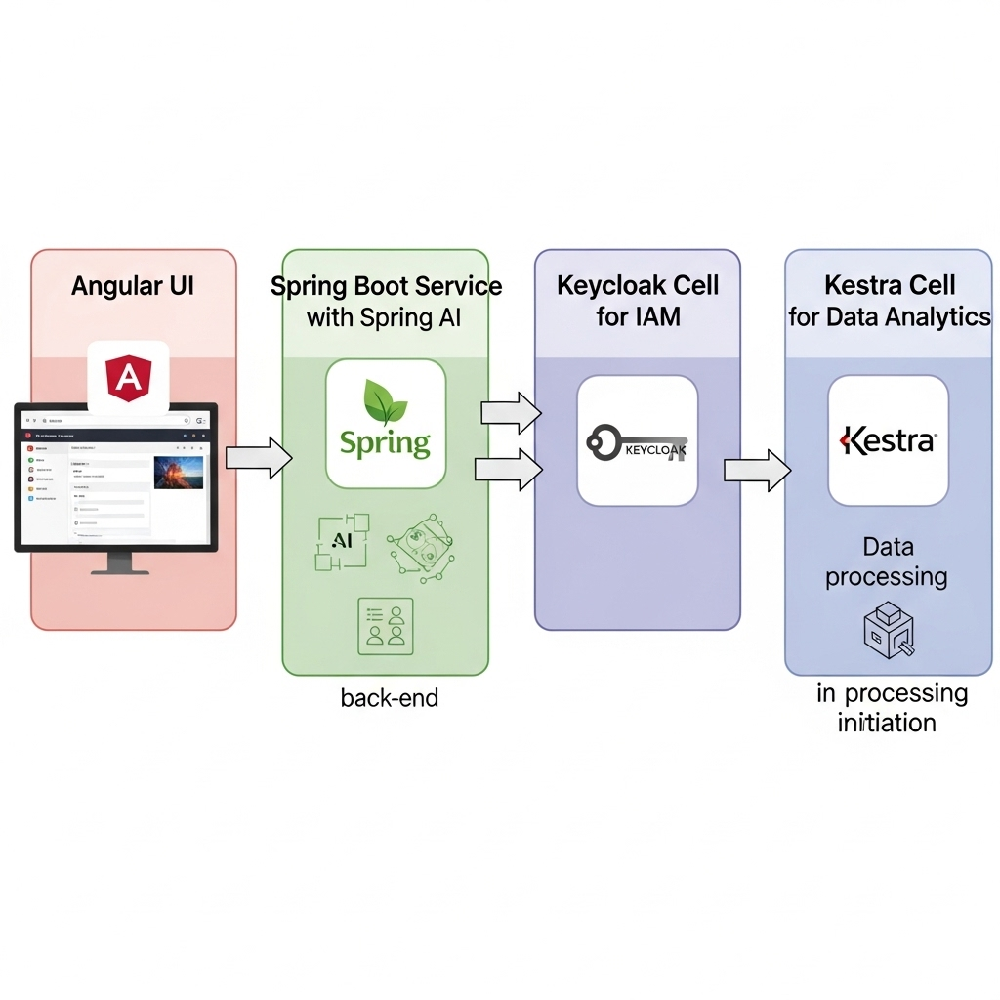
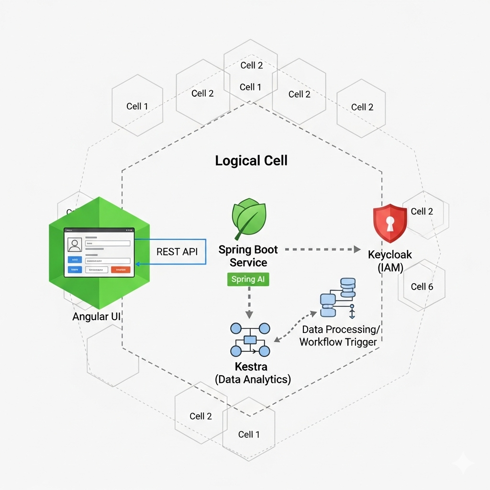
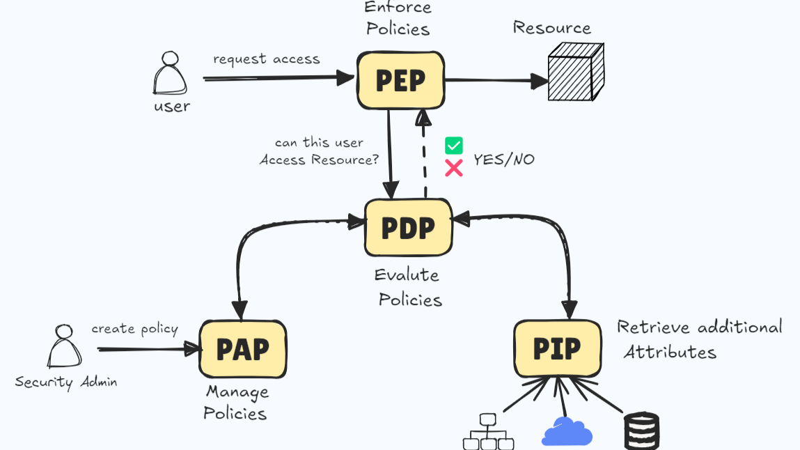
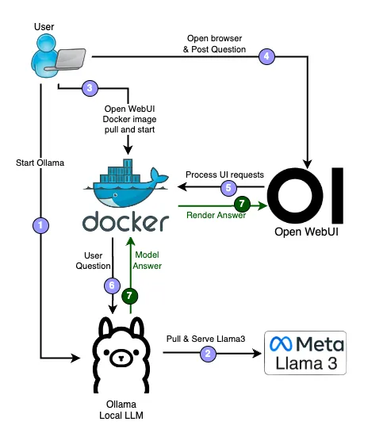

## Intro
The project is there to grow, add useful features,
reflect an on prem capability landscape

See
<https://github.com/alfrepo/cell-project>


The project is there to grow, add useful features,
reflect an on prem capability landscape.


The goal:
 - use as many modern methods as possible
 - vibe coding
 - ai agents
 - define common dockerization patterns


 
 


## Scope and Context


### Cell: Custom Spring Boot service
Spring Boot application


#### Feature: Spring AI

Demonstrating some of
    - Chat Completion
    - Embedding
    - Text to Image
    - Audio Transcription
    - Text to Speech
    - Moderation

<https://spring.io/projects/spring-ai>


```text
projects-root/
├── digital.alf.customsbs/
│   ├── .gradle/
│   │   └── ...
│   ├── src/
│   │   ├── main/
│   │   │   ├── java/
│   │   │   │   └── digital/
│   │   │   │       └── alf/
│   │   │   │           └── customsbs/
│   │   │   │               ├── CustomSbsApplication.java
│   │   │   │               ├── config/
│   │   │   │               ├── controller/
│   │   │   │               ├── model/
│   │   │   │               ├── repository/
│   │   │   │               └── service/
│   │   │   └── resources/
│   │   │       ├── static/
│   │   │       └── application.yml
│   │   └── test/
│   │       └── java/
│   │           └── digital/
│   │               └── alf/
│   │                   └── customsbs/
│   ├── build.gradle
│   ├── Dockerfile
│   ├── gradlew
│   ├── gradlew.bat
│   └── settings.gradle
│
├── another-project/
│   └── ...
│
└── docker-compose.yml 
```


### Cell: Angular PrimeNG based UI & Progressive Web App

The UI with
 - desktop
 - mobile experience

### Cell: Physical access control

Should calculate physical access 

- implementing "PIP" using ABAC
- interpreting into "PDP" using ACL
- and making decisions in "PEP"


 


#### **Access Control Model Comparison: ACL vs. RBAC vs. ABAC**

   * ACLs are the oldest and simplest model. They attach a list of permissions directly to a resource (like a file or a network port).  

   * RBAC solves the scalability problem of ACLs by introducing an abstraction layer: the **Role**. You assign permissions to a role, and then assign users to that role.  

   * ABAC is the most modern and flexible. It removes the reliance on static roles and makes access decisions based on evaluating a policy against a set of real-time attributes.  

| Feature                       | Access Control Lists (ACL)                                                                                                   | Role-Based Access Control (RBAC)                                                                                                    | Attribute-Based Access Control (ABAC)                                                                                                                                                                    |
|:------------------------------|:-----------------------------------------------------------------------------------------------------------------------------|:------------------------------------------------------------------------------------------------------------------------------------|:---------------------------------------------------------------------------------------------------------------------------------------------------------------------------------------------------------|
| **Core Principle**            | **Resource-Centric:** Explicitly lists *who* (user/group) can do *what* on *this specific resource*.                         | **Role-Centric:** Access is granted based on a user's *job function* (Role).                                                        | **Policy-Centric:** Access is granted based on a dynamic set of **attributes**.                                                                                                                          |
| **Key Question Asked**        | "Can *this specific user* (or group) read this file?"                                                                        | "What permissions does the *role* of 'Manager' have?"                                                                               | "Can a user from the 'Sales' department, located in 'NY' (User Attribute), 'Write' (Action Attribute) to a file tagged 'Confidential' (Resource Attribute) between 9am and 5pm (Environment Attribute)?" |
| **Granularity & Flexibility** | **Fine-grained but static:** Great for a single resource, but cannot easily incorporate external context (like time of day). | **Medium:** Excellent for defining access based on functional duties, but poor at handling exceptions or dynamic, contextual rules. | **Highly Granular and Dynamic:** Supports complex, contextual rules that change in real-time based on any combination of attributes.                                                                     |


#### ACL


| Scenario                                    | Principal              | Action     | Resource                     | Condition                                                                   |
|:--------------------------------------------|:-----------------------|:-----------|:-----------------------------|:----------------------------------------------------------------------------|
| **1\. Standard Employee Site Access**       | Group: Employees       | Enter      | Site: Main Campus Building A | Authentication: Successful Badge Swipe                                      |
| **2\. Management Office Zone Access**       | Group: Managers        | Enter/Exit | Zone: Executive Wing         | Time: 08:00 to 18:00 (Weekdays)                                             |
| **3\. Restricted Data Center Access**       | User: ID: 87654        | Enter      | Zone: Data Center \- Rack 5  | Certification: "Server Admin L3" is true $\\wedge$ 2FA: Successful Bio-scan |
| **4\. Maintenance Zone Access (Off-Hours)** | Group: Facilities Team | Enter/Exit | Zone: HVAC Mechanical Room   | Time: Outside 07:00 to 19:00                                                |
| **5\. Visitor Access to Common Areas**      | Group: Visitors        | Enter      | Zone: Lobby & Cafeteria      | Escort: Employee ID: 12345 (must be present) $\\wedge$ Time: Before 17:00   |
| **6\. Emergency Exit Usage**                | Group: All Users       | Exit       | Site: Any Exit Door          | Alarm: Fire Alarm is Active                                                 |
| **7\. Contractor Access to Site**           | Group: Contractors     | Enter      | Site: Main Campus Building A | Date: Today is before Contract End Date $\\wedge$ Time: 09:00 to 16:00      |


#### ABAC

``` yaml

apiVersion: kyverno.io/v1
kind: ClusterPolicy
metadata:
  name: abac-enroll-restriction-time-bound
  annotations:
    policies.kyverno.io/description: |
      Restricts the 'ENTER' operation on 'Facility' resources labeled 'location: 
      "production-room"' to users possessing the 'training-vde-available-group' attribute. 
      This restriction is only enforced during a critical, 
      specific time window (2025-10-20T08:00:00Z to 2025-10-20T09:00:00Z) for members of the 'employee-group'.
spec:
  validationFailureAction: Enforce # Immediately block request
  background: false
  rules:
    - name: deny-enroll-without-training-vde
      match:
        # 1. Subject Attribute: The group must be 'employee-group'
        subjects:
          - kind: Group
            name: employee-group

        # 2. Resource Attribute: The target resource must be one of the locations
        resources:
          kinds:
            - Facility # Example: A Custom Resource for physical facilities
          selector:
            matchLabels:
              location: "production-room"
              # NOTE: A second rule or a more complex match for 'storage-room' would have to follow here.

        # 3. Operation Attribute: The operation 'Enroll' (assumed as UPDATE)
        operations:
          - ENTER
          - EXIT

      # TEMPORAL PRECONDITION: The rule is ONLY executed if the time is within the window.
      preconditions:
        all:
          # Define the 1-hour window
          - key: "{{ time_between('{{ time_now_utc() }}', '2025-10-20T08:00:00Z', '2025-10-20T09:00:00Z') }}"
            operator: Equals
            value: true

      # The ABAC logic (is only executed if the time condition is TRUE)
      deny:
        conditions:
          all:
            # Condition 1 (Positive Group): User is in the main group (Redundancy/Clarity)
            - key: employee-group
              operator: AnyIn
              value: "{{ request.userInfo.groups }}"

            # Condition 2 (Negative Attribute Check): The training attribute is missing
            - key: "training-vde-available-group"
              operator: AnyNotIn
              value: "{{ request.userInfo.groups }}"

      validate:
        message: "ATTENTION: The 'Enroll' operation is only allowed for qualified personnel ('training-vde-available') during the critical time window (08:00-09:00 UTC).

```


### Cell:  BPM

Similar to Camunda BPM, or forks
https://cibseven.org/preise/ - 71 forks and 219 stars


### Cell: IAM KeyCloack

Should provide IAM for upper service.

Outcome:
understand multi-tenancy, realms

Integrate "Keycloack"


### Cell: Authorization and Policy Decision Point 
Integrate "Kyverno" as "POlicy Decision POint"
https://www.strongdm.com/what-is/policy-decision-point-pdp

### Cell Analytics 

Should take data from upper Service


#### Cell: Kestra.io

Outcome:
To get data from my service and put it into the raw data layer


#### analytical databases 1 : DuckDB
DuckDB


#### analytical databases 2 : Clickhouse
Clickhouse


#### SuperSet
AI Dashboard


### Cell: local RAG

Deployment overview
<https://medium.com/@miroslavmerreider/unlocking-the-power-of-local-offline-retrieval-augmented-generation-with-ollama-and-open-webui-19cd0bc67e81>


Example with RAG
<https://github.com/alexandrainst/alex-rag-webui>


 


 - Start Ollama: The user initiates the Ollama application, which acts as the server for the local LLM.

- Pull & Serve Llama 3: Ollama connects to the internet to download the Llama 3 model from Meta's repository and loads it onto the user's machine, making it ready for processing requests. 3.  Open WebUI Docker: The user runs Open WebUI as a Docker container, isolating the application and its dependencies.

- User Interaction: The user opens a browser, navigates to the Open WebUI interface, and enters a question.

- Process UI Requests: The Open WebUI container receives the user's question. It then sends this request to the Ollama server.

- Process Model Answer: Ollama receives the question, processes it using the Llama 3 model, and generates a response.

- Render Answer: The generated answer is sent back from Ollama to the Open WebUI container, which then displays the final response to the user's browser.

- Web Search for RAG: Perform web searches using providers like SearXNG, Google PSE, Brave Search, serpstack, serper, Serply, DuckDuckGo, TavilySearch, SearchApi and Bing and inject the results directly into your chat experience.

### Flutter Mobile App.
Hello World to access my API.


#### Business Case of App
Use AI on Edge.
Recognize hand written code (KLeiderbörse).
Append to a Google Docs file, written in configured online store.

Columns

- code
- price
- date time
- complete recognized string


## Constraints


## Solution Strategy

## Building Block View

## Runtime View

## Deployment View

## Cross-cutting Concepts

## Architectural Decisions

| Problem               | Decision       | Optimize for attribute   |
|-----------------------|----------------|--------------------------|
| Delivery package      | Docker Cpmpose | Simplicity of deployment |
| Delivery inside of VM | Ansible        | Simplicity of deployment |
| CICD                  | GitHub CICD    |                          |

## Quality Requirements

## Risks and Technical Debt

## Glossary

