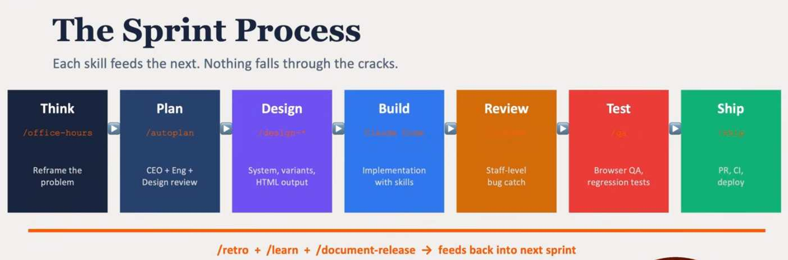

## Intro

Software development is undergoing a fundamental shift. Where AI once served as a smart autocomplete, it now operates as an autonomous participant — planning, writing, testing, and committing code with minimal human direction. This is agentic AI coding: AI systems that don't just respond to prompts but pursue goals across multi-step workflows.

For engineering organizations, this changes everything: how teams are structured, how code quality is enforced, how security is maintained, and how humans and machines collaborate. This article maps out the most important approaches, management techniques, and security practices for organizations embracing agentic AI coding at scale.


## Goals

- Define most important approaches to adoption of "Agentic AI coding" in software writing organizations
- Define the techniques to manage an army of AI agents and ensure secure and well maintained software
- Define the techniques to do SECURE coding with AI


## Approaches to Adopting Agentic AI Coding

### 1. Start with Augmentation, Not Replacement

Most successful adoptions follow a progression: autocomplete → chat-driven code → inline agents → autonomous agents. Jumping straight to fully autonomous agents without building organizational muscle memory creates quality and trust deficits.

**Augmentation tiers:**

| Tier | Mode                                                                 | Human involvement                               |
|------|----------------------------------------------------------------------|-------------------------------------------------|
| 1    | Inline completion (Copilot-style)                                    | Developer reviews every line                    |
| 2    | Chat-driven generation                                               | Developer prompts and reviews blocks            |
| 3    | Task-scoped agents (e.g., fix this bug, write tests for this module) | Developer reviews diffs                         |
| 4    | Autonomous agents on issues/PRs                                      | Developer reviews PR, CI enforces quality gates |

Start at tier 2–3 and graduate teams to tier 4 only after establishing review and rollback practices.

### 2. Define the Agent's Scope of Authority

Agents must have explicit permission boundaries. Define what an agent is allowed to do without human approval:

- Read code, write code, run tests: **low risk** — allow autonomously
- Create PRs, open issues, update documentation: **medium risk** — allow with notification
- Merge PRs, deploy, modify CI/CD pipelines, touch secrets: **high risk** — require explicit human approval

Document these boundaries in your AGENTS.md or equivalent governance file, and enforce them technically (not just by convention).

### 3. Integrate Agents into the Existing SDLC

Agentic AI works best when it operates within — not around — your existing software development lifecycle. Key integration points:

- **Issue trackers**: Agents pick up labeled issues (e.g., `ai-agent`) and open PRs against them
- **CI/CD pipelines**: All agent-generated code passes the same pipelines as human-written code — no exceptions
- **Code review**: Agent PRs go through the same review process; reviewers know the author is an agent
- **Branching strategy**: Agents always work on feature branches, never push directly to `main`

### 4. Build Feedback Loops for Continuous Improvement

Agentic coding quality improves when agents learn from outcomes. Invest in:

- **Structured prompts** checked into version control alongside the code (e.g., `.claude/` or `.github/agents/`)
- **Metrics dashboards**: PR acceptance rate, review iteration count, test coverage delta, build failure rate per agent
- **Incident retrospectives**: When an agent introduces a bug or regression, document what prompt or policy change prevents recurrence

### 5. Establish an AI Coding Center of Excellence

For organizations beyond initial pilots, a cross-functional center of excellence (CoE) accelerates safe adoption:

- Sets standards for agent configuration and prompt libraries
- Runs red-team exercises against agent-generated code
- Owns the toolchain (model selection, IDE extensions, API usage policies)
- Maintains the audit trail and compliance posture


## Managing an Army of AI Agents

### 1. Agent Identity and Accountability

Every agent that commits code or interacts with systems must have a distinct, traceable identity:

- Use dedicated service accounts or bot users (e.g., `agent-bot@company.com`, GitHub Apps)
- Sign commits with agent-specific GPG keys or use commit co-authorship (`Co-Authored-By:`) to attribute agent contributions
- Log all agent actions with a correlation ID linking back to the triggering task or prompt

Without identity, you cannot audit, you cannot revoke, and you cannot investigate incidents.

### 2. Least-Privilege Access for Agents

Agents should have the minimum permissions required to complete their task:

- **Repository access**: Scope to the specific repos the agent operates on; never org-wide write
- **Secrets access**: Agents should not have access to production secrets. Use ephemeral, scoped tokens
- **Network access**: Where possible, run agents in network-restricted environments; block outbound access to non-whitelisted endpoints
- **Blast radius control**: Run agents in isolated environments (containers, sandboxes) so a compromised or misbehaving agent cannot affect neighboring systems

### 3. Orchestration and Coordination

When multiple agents operate in parallel on the same codebase, coordination prevents conflicts and cascading errors:

- **Exclusive locks on files or modules**: Use branch-per-task to prevent simultaneous edits to the same files
- **Agent queues**: Don't allow unbounded parallelism; rate-limit agent task dispatch
- **Dependency graphs**: If agent B depends on agent A's output, enforce sequencing in your orchestration layer (e.g., GitHub Actions, Temporal, Airflow)
- **Conflict resolution policy**: Define what happens when two agent PRs touch the same code — automated rebase, human tiebreaker, or discard

### 4. Enforcing SDLC Pipelines in Agentic Systems

The sprint process in that image is essentially an SDLC pipeline — and the core challenge with agentic systems is they tend to short-circuit stages (jumping from "plan" straight to "build", skipping design and review). Here's how to enforce the full pipeline.

The core problem is that agents, left to themselves, will find the shortest path to "done" — which usually means skipping Think, Design, and Review entirely and going straight to Build. Here's how you force them through every stage:

- **Structured output gates (strategy 1)** are the most robust. Each stage must return a typed JSON schema before the next stage's prompt is even constructed. No valid PlanOutput object? The pipeline errors — it physically cannot proceed to Design.
- **Stage-specific system prompts (strategy 2)** mean the agent literally doesn't know the next stage exists until the current one closes. You construct and inject the Build prompt only after you've received and validated the Design artefact. The agent can't jump ahead because it has no context to jump to.
- **Human-in-the-loop checkpoints (strategy 3)** are what the diagram already implies with "CEO + Eng + Design review" in Plan. This is non-negotiable for high-stakes stages — a human must click approve before the orchestration continues.
- **Mandatory artefacts (strategy 4)** are the paper trail version: the pipeline checks for the existence of a file or URL before advancing. No /design-*.html output file? The Build stage throws, not the agent.
- **The orchestrator agent (strategy 5)** is the meta-level approach — a supervisor model whose only job is stage transitions. It calls each specialist agent, validates the output, and decides whether to advance or loop back.

### 5. Human-in-the-Loop Gates

Full autonomy is appropriate only for low-risk, reversible operations. Build mandatory human gates for:

- Any PR that modifies infrastructure-as-code, auth logic, or security-sensitive modules
- Agents that have failed more than N tasks in the past M days (circuit breaker pattern)
- Any action that cannot be trivially rolled back

Implement these gates in your CI/CD pipeline as required status checks, not optional suggestions.

### 6. Monitoring and Observability

An agent fleet without observability is ungovernable. Instrument:

- **Agent activity logs**: What did each agent do, in what order, triggered by what?
- **Code quality metrics**: Is agent-generated code diverging from team norms over time?
- **Security scan results**: Track vulnerability findings per agent, per model, per prompt template
- **Drift detection**: Periodically diff agent behavior against known-good baselines

Use alerting to catch anomalies: an agent opening an unusual number of PRs, touching files outside its normal scope, or triggering repeated CI failures.

### 7. Lifecycle Management

Agents are software. Treat them accordingly:

- Version-control your agent configurations, prompts, and tool definitions
- Test agent behavior in a staging environment before rolling out changes
- Deprecate and rotate agent credentials on a schedule
- Maintain a kill switch: a way to halt all agent activity org-wide within minutes


## Secure Coding with AI

### 1. Never Trust Agent Output as Secure by Default

AI models are trained on public code, which includes insecure code. Common vulnerabilities introduced by AI-generated code include:

- **Injection flaws**: SQL injection, command injection, prompt injection in AI-adjacent code
- **Hardcoded secrets**: API keys, passwords, tokens embedded in source
- **Insecure defaults**: Disabled TLS verification, overly permissive CORS, weak cipher suites
- **Dependency confusion**: AI suggesting package names that may be typosquatted or unmaintained

Treat AI-generated code with the same (or higher) scrutiny as code from a junior developer unfamiliar with your security requirements.

### 2. Enforce Security Gates in CI

Every agent PR must pass automated security gates before merge:

- **SAST** (Static Application Security Testing): Tools like Semgrep, SonarQube, or CodeQL scan for vulnerability patterns
- **Secret scanning**: GitHub Advanced Security, Gitleaks, or Trufflehog catch hardcoded credentials before they land in history
- **Dependency scanning**: Dependabot, Snyk, or OWASP Dependency-Check flag known-vulnerable packages
- **License compliance**: Ensure AI-suggested dependencies don't introduce license conflicts

Make these checks required status checks — not advisory — so no agent PR can bypass them.

### 3. Security-Focused Prompt Engineering

The security of agent output starts with the prompt. Include explicit security requirements:

```
You are writing code for a financial services application.
Requirements:
- All SQL queries must use parameterized statements, never string concatenation
- Never log sensitive fields (passwords, tokens, PII)
- Use the project's existing auth middleware for all protected endpoints
- Do not add new dependencies without flagging them for review
```

Maintain a library of security-aware prompt templates checked into version control. Review and update them when new vulnerability classes emerge.

### 4. Code Review with a Security Lens

Human reviewers of agent PRs should apply a security-specific checklist:

- [ ] Are all external inputs validated and sanitized?
- [ ] Are secrets retrieved from the secret store, not hardcoded?
- [ ] Does new code introduce new attack surface (new endpoints, new file I/O, new subprocess calls)?
- [ ] Are error messages safe to expose (no stack traces, no internal paths)?
- [ ] Does the code follow the principle of least privilege?

Consider tagging agent PRs with a label (e.g., `agent-generated`) to signal to reviewers that extra security scrutiny applies.

### 5. Supply Chain Security for AI-Suggested Dependencies

AI models frequently suggest third-party libraries. Each new dependency is a potential supply chain risk:

- **Verify package provenance**: Check download counts, last update date, and maintainer reputation before accepting
- **Pin dependency versions**: Use exact versions or digests, not floating ranges, in AI-generated dependency additions
- **Audit transitive dependencies**: A safe top-level package can pull in vulnerable transitive deps
- **Use a private registry or approved package list**: Restrict agents to suggesting only pre-approved packages

### 6. Prompt Injection Awareness

When agents process external content (reading issues, summarizing PRs, parsing user-submitted data) they are vulnerable to prompt injection: malicious instructions embedded in that content.

Mitigations:
- **Input sanitization**: Strip or escape instruction-like patterns from external content before passing it to agents
- **Role separation**: Use separate model calls for "analyze this external content" vs. "take action on this codebase"
- **Output validation**: Validate agent actions against a schema before executing — reject actions outside the expected envelope
- **Sandboxing**: Limit what actions an agent can take even if successfully injected

### 7. Compliance and Audit Trails

For regulated industries, AI-generated code must be auditable:

- Retain the full prompt, model version, and output for every agent action
- Map agent contributions to compliance controls (e.g., PCI DSS, SOC 2, HIPAA)
- Include agent identity in change management records
- Periodically review retained logs for anomalies and policy violations

---

## Summary

Adopting agentic AI coding is not primarily a technology problem — it is a governance, process, and culture problem. The organizations that succeed treat agents as powerful but untrusted collaborators: scoped, observed, and held to the same quality and security standards as human developers. The table below summarizes the key practices:

| Area             | Key Practice                                                                               |
|------------------|--------------------------------------------------------------------------------------------|
| Adoption         | Progressive tiers, scope-bounded authority, SDLC integration                               |
| Agent management | Identity + least privilege, orchestration, human gates, observability                      |
| Secure coding    | CI security gates, secure prompt templates, supply chain hygiene, prompt injection defense |

The goal is not to slow down AI coding — it is to make it fast *and* trustworthy.


## Links

- <https://youtu.be/wkv2ifxPpF8?si=oemoLmPDkSUwyimj&t=990>

 