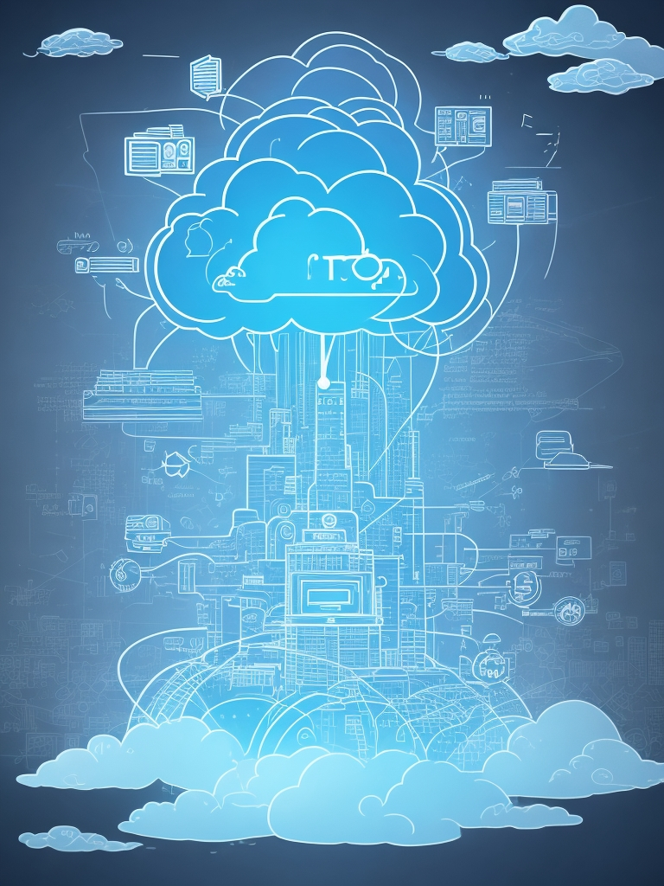

## Intro

Case:

```
you must create a roadmap for an "IoT Plattform".
```

Tactics: 

- Use visual aids like diagrams, charts, or slides to illustrate your points.
- Be confident and articulate while explaining your strategy.
- Tailor your strategy to fit the company's culture, values, and objectives.

Concentrate on demonstrating a solid understanding of **business strategy**, **technical knowledge**, **risk management**, and **adaptability** must showcase your capability in creating a roadmap for a Cloud and IoT platform.





## Case split

When demonstrating the creation of a roadmap and business strategy for a Cloud and IoT platform , you can follow these steps to showcase your expertise and approach:


### 1. Understand the Company's Needs:
- Begin by discussing the company's current situation, its goals, and challenges related to Cloud and IoT implementation. Show that you've done your research and understand their specific needs.

// TODO structure the data 
// formulate the needs as needs, not objectives or goals


#### Operational needs 

- **Quality control improvals on Assembly lines for Business Unit Y** 
   - Continuosly do quality control, which goes beyond simple calculations, which can be done on edge.
   Go beyond 1 sensor to make decisions.

 - **Remote Monitoring and Maintenance of created Equipment X** 
   - Enable remote monitoring of machinery and equipment. 
    This allows to track performance, detect issues, and schedule predictive maintenance, reducing downtime and improving operational efficiency.

- **Real-Time Data Analytics of Sensor X** 
  - access the data life, to make real-time data-driven decisions to optimize the factory processes. Detect anomalies like temperature rising beyond the norm. Act: er.g. rise an alert.

- **Predictive maintainance of Equipment X** 
  - reduce unexpected breaking of the machines, by recognizing the known patterns like vibration, which corelate with breaking of machines. Act by rusing an alarm.


### 2. Define Objectives and Goals:
- Clearly outline the objectives of the Cloud and IoT platform. Are they aiming to improve efficiency, reduce costs, enhance customer experience, etc.?
- Set specific, measurable, achievable, relevant, and time-bound (SMART) goals.

Enabler Objectives:

- As a **Business Unit Automotive** I must be enabled to connect the assembly line products to the IoT Platform **within 1 year** to cover the "Predictive Maintainance" case
   - for Sensors X
   - Instrumentation Equipment Y
   - Automotive Testing Solutions Z
   - Industrial Process Control Systems


### 3. Develop a Roadmap:
- Illustrate a step-by-step plan to achieve those objectives. This roadmap should encompass different phases, including planning, implementation, testing, and ongoing improvements.
- Highlight the key milestones and deliverables at each stage.

### 4. Highlight Technology and Architecture:
- Discuss the technology stack you would recommend for the Cloud and IoT platform, emphasizing scalability, security, and interoperability.
- Address the architectural design, considering flexibility and future integration with other systems.

### 5. Risk Management and Contingency Plans:
- Acknowledge potential risks such as cybersecurity threats, data privacy concerns, or technological limitations. Offer strategies to mitigate these risks.
- Show your ability to adapt by including contingency plans for potential roadblocks.

### 6. Financial Projections:
- Present a cost-benefit analysis and financial projections. Detail the investment required, potential cost savings, and revenue generation from the platform.

### 7. Collaboration and Stakeholder Involvement:
- Emphasize the importance of involving key stakeholders in decision-making and implementation. Highlight the need for collaboration between departments and teams.

### 8. Execution and Measurement:
- Discuss how you would execute the plan, including resource allocation, team roles, and responsibilities.
- Explain how you'll measure the success of the strategy, using KPIs, metrics, and regular evaluations.

### 9. Communication and Adaptation:
- Highlight the significance of transparent and regular communication within the company about progress and changes in the strategy.
- Show your ability to adapt the strategy based on feedback and evolving technology trends.

### 10. Use Case or Case Study:
- If possible, provide a real or hypothetical use case or case study showcasing a successful implementation of a similar strategy in a previous role.


## Links


- 

